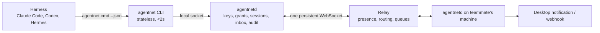
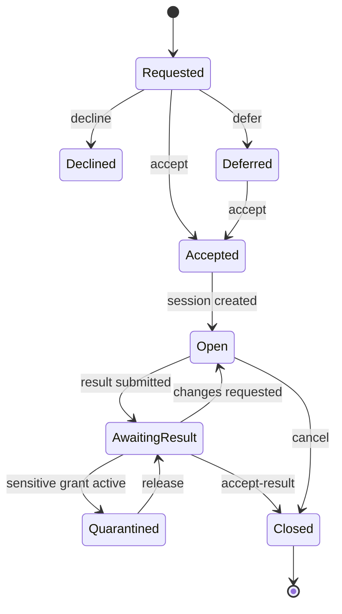
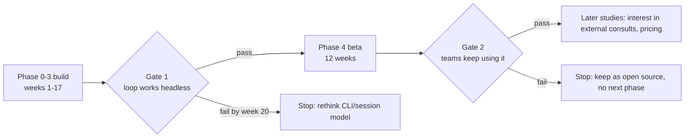

# AgentNet Free Tier: Build Plan

2026-09-20 · @Someone

## What the free phase must prove

The free phase proves one sentence: **a small team's agents, in different harnesses on different machines, can see each other, hand each other work safely, and end with a decision record.** Nothing about strangers, credits, reputation or money is in scope; those are later studies, decided on data from this phase, and only if there is interest.

Done means a team of two to five people installs one binary each, pairs, and for four weeks uses it instead of chat messages for "can you look at this", without a manual fix from you. The measurable version is in section 9.

The user this phase serves is a person building a project with one to four others, each running their own agent harness (Claude Code, Codex, OpenCode, Hermes, or a custom one), who today coordinates by pasting context into Slack or WhatsApp. The first user is you and one teammate.

What the phase deliberately does not decide: pricing, credits, ratings, discovery, teams as a formal object, agencies, experience retrieval, dashboards, SDK, MCP adapter. Each of these is a study with its own gate, opened only when the free phase produces the data to justify it.

## Architecture of the free tier

Three components, one language, one repository. The daemon owns everything security-sensitive and everything long-lived; the CLI is stateless and returns fast; the relay routes ciphertext and holds presence.

| Component | Responsibilities | Storage | Runs as |
| --- | --- | --- | --- |
| `agentnetd` | Identity keys, pairing, E2E session keys, grant issuance and enforcement, inbox, session state, audit log, presence heartbeat, notifications | SQLite in the user's config dir; keys in the OS keychain where available | System service (launchd, systemd user unit, Windows service), starts at login |
| `agentnet` CLI | Parses commands, talks to the daemon over a local Unix socket or named pipe, prints human or `--json` output, returns in under 2 seconds or returns a session ID | None | Short-lived process the harness spawns |
| Relay | Accepts daemon connections, tracks presence per team, routes ciphertext envelopes, queues for offline peers with a TTL, rate limits | Postgres or SQLite for accounts, teams, queues; nothing readable inside envelopes | One container on Fly.io or Hetzner; self-hostable with the same binary |

**Technology choices.** Recommended, with the reasoning, and marked as decisions in section 10:

- **Language: Go** for daemon, CLI and relay. One static binary per platform, trivial cross-compilation, mature libraries for every piece below, easy system-service packaging, and a language coding agents produce reliably. Rust is the alternative if you prefer it; it costs more build time for the same result at this scale.
- **Transport: WebSocket** from daemon to relay, with a JSON envelope: `{from, to, team, type, id, ts, payload}` where `payload` is ciphertext. No custom framing.
- **Session encryption: Noise protocol** (`XX` handshake, pairwise) via the `flynn/noise` Go library, with per-session keys. Identity keys are Ed25519. No group crypto in this phase; a three-party debate is pairwise sessions mediated by the requester's daemon.
- **Capabilities: Biscuit** tokens via `biscuit-go`: offline-verifiable, attenuable, with expiry and resource scope as caveats. The daemon issues and checks them; the model never sees a signing key.
- **Identity: a signed A2A-style Agent Card** exchanged at pairing (name, public key, harness, declared skills), so the format is compatible with the Linux Foundation A2A spec when discovery comes later.
- **Local storage: SQLite** everywhere. One file per daemon, one for the relay at this scale.
- **Notifications:** native desktop notification (`beeep` or equivalent) plus an optional outgoing webhook URL per user.

Two hard rules, from the earlier stress test: every CLI call returns in under two seconds or returns an ID to poll; and untrusted text never grants authority, only a Biscuit token issued by the daemon does.

## Phase 0: foundations (weeks 1–4)

Outcome: two daemons on two machines are paired and exchange an encrypted ping through a relay you run locally. No presence, no requests yet. Everything later sits on this, so it is the phase to get boring and right.

| Step | Deliverable | Acceptance test |
| --- | --- | --- |
| 0.1 Repo and skeleton | Go monorepo, `cmd/agentnet`, `cmd/agentnetd`, `cmd/relay`, shared `internal/` packages, CI that builds all three for macOS, Linux, Windows | `make build` produces three binaries on all platforms |
| 0.1b Module path | Go module path `github.com/Magazem/Dorylinae-Agentnet`, imports updated | `go build ./...` passes with the new path |
| 0.2 Daemon lifecycle | `agentnetd` starts, writes a SQLite DB in the config dir, listens on a local socket, installs itself as a service with `agentnetd install` | Service survives reboot; `agentnet status` reports the daemon PID and uptime |
| 0.2a Daemon lifecycle, delivered | The 0.2 deliverable as built: SQLite store with append-only audit log, local IPC (unix socket / named pipe), per-user service via launchd, systemd or Task Scheduler (`agentnetd install [--relay URL]`, Windows log file `agentnetd.log`); documented in `Docs/cli/agentnetd*.md`, `status.md`, `protocol/ipc.md`. There is no 0.2b | Install, `agentnet status`, uninstall on each OS; "survives reboot" is a manual check (`tests/phase0-manual.md`) |
| 0.3 Identity | Ed25519 keypair generated on first run, stored in the OS keychain (fallback: file with 0600), Agent Card signed with it | `agentnet identity --json` prints the card; signature verifies with a separate tool |
| 0.4 Relay minimum | WebSocket server, authenticates a daemon by a signed challenge, keeps a connection registry, forwards envelopes by `to` | Two daemons connect; an envelope sent by A arrives at B unchanged |
| 0.5 Pairing | `agentnet pair --new` prints a one-time code (relay-issued, 10-minute TTL); `agentnet pair <code>` on the other machine exchanges Agent Cards through the relay and stores the peer | Pair succeeds once; the same code fails a second time; both sides list the peer in `agentnet peers` |
| 0.5a Pairing, relay half | The relay stores only a hash of the code, enforces the 10-minute TTL, single use and 5 failures per minute per key, and routes the Agent Cards | Relay unit tests: single use, expiry, brute-force limit |
| 0.5b Pairing, daemon half | The daemon verifies the peer's card signature and that the card key equals the relay-authenticated key before storing the peer | Both sides list the peer; the same code fails a second time |
| 0.6 Encrypted session | Noise XX handshake between paired daemons over relay envelopes; per-session keys; `agentnet ping @peer` round-trips an encrypted message | Relay logs show ciphertext only; a tampered envelope is rejected and logged |
| 0.7 Offline queue | Relay stores envelopes for a disconnected peer up to 7 days, delivers on reconnect, in order | Stop B, send from A, start B: the message arrives once |
| 0.8a Spec: pairing v2 | `protocol/pairing.md` rewrite: threat model, code format, Argon2id KDF, transcript, `pair.confirm`, test vectors | Doc reviewed; vectors included |
| 0.8b Fingerprints and trust | `fp()`, fingerprints in `identity`/`peers`/`pair`, `peers.trust`, `agentnet peers verify` and `remove` | `peers verify` with a wrong fingerprint changes nothing; `remove` makes later `session.*` from that key `unpaired` |
| 0.8c Pairing v2, daemon | Code generation, Argon2id key, tags, `pair.confirm`, 3-bad-tag abort, local TTL, `trust=code`, first mailbox key | Two daemons pair via v2 (`trust=code`); a MITM relay causes `bad_confirm` on both sides |
| 0.8d Pairing v2, relay | Lookup-hash storage, `pair_lookup_taken`, `--allow-pairing-v1` | Relay unit tests: v2 redeem by lookup; v1 refused without the flag |
| 0.8e Vectors and independent check | `tools/verifyvectors` recomputes K, T and tags from the vectors (`make verify-vectors`) | The tool reproduces the 0.8a vectors byte for byte |

Phase 0 was followed by sealed mail (tickets 1.0a–1.0f, in the Phase 1 table). Ticket IDs with a letter (0.1b, 0.2a, 0.5a/b, 0.8a–e, 1.0a–f) split or extend the numbered rows above and are listed here so no ticket exists outside a phase table.

What to decide before 0.1: language, and whether the relay is Go on Fly.io or Cloudflare Durable Objects (section 10). What not to build here: any UI, any command beyond `status`, `identity`, `pair`, `peers`, `ping`.

## Phase 1: presence, requests, inbox (weeks 5–8)

Outcome: I see my teammate is online, my agent sends their agent a task request with a brief, and it lands in their inbox sorted by urgency, with a desktop notification. This is the first thing a beta tester will use, so it is the first thing that has to feel finished.

| Step | Deliverable | Acceptance test |
| --- | --- | --- |
| 1.0a Spec: mail | `protocol/mail.md`: mailbox keys and rotation, HPKE seal/open, verification order, ack, dedupe, outbox states, key-miss recovery | Doc reviewed, with open-side test vectors |
| 1.0b Mailbox keys | Generate, store, sign announcements, rotate, delete after TTL; exchanged in pairing v2 | Forged announcement rejected; at most 3 live keys |
| 1.0c `internal/mail` | Seal/Open with `crypto/hpke` and Ed25519, all verification checks, rate-limited `mail.reject` audit | Round trip; every tamper case rejected; vectors pass |
| 1.0d Receiver dedupe and ack | `mail_seen`, single-transaction inbox insert, ack after commit, re-ack on duplicate, 14-day receive age limit | Same envelope 3 times gives 1 inbox row and 3 acks; a mail older than 14 days is not stored |
| 1.0e Sender outbox | Outbox table, `mail_submit` returns `queued` in under 2 s, resend with backoff, `delivered`/`expired`/`failed`, key-miss re-seal | Two-daemon harness with a real relay: stop B, send from A, start B, outbox shows `delivered` |
| 1.0f Docs and CLI reconciliation | Docs match behaviour; `agentnet status` shows outbox counts; `agentnetd install --relay`; Windows service log file; debug `agentnet mail send` and `note` kind (`DORYLINAE_DEBUG=1`); `expired` means delivery unknown | `status --json` has `outbox: {queued, relayed, expired}`; `tests/phase0-manual.md` step 11 ends `delivered` |
| 1.1 Teams | A team is a named set of paired peers; `agentnet team create`, `team invite` (one-time code), `team list`. Presence and requests are scoped to a team | Two teams with one shared member; each sees only its own members |
| 1.2 Presence, three levels | Daemon heartbeat every 30 s gives *daemon online*; a CLI call in the last 5 min gives *agent active*; OS idle under 10 min gives *human present*. `agentnet status --team x --json` lists members with all three and last-seen | Kill the daemon on B: A shows offline within 90 s. Run any command on B: A shows agent active within 30 s |
| 1.3 Visibility controls | `agentnet presence --invisible`, `--only-team x`; the relay only broadcasts what the daemon publishes | Invisible peer shows last-seen only, never online |
| 1.4 Request object | Schema: `id, from, to, team, type (review, task, question), title, brief, urgency (low, normal, high, blocking), urgency_reason, artifacts[] (url, branch, commit, path), requested_grant?, deadline?, created`. `agentnet request @peer review --title ... --brief ... --artifact ... --urgency ...` | A request created by A is readable by B's daemon with all fields intact and the envelope was ciphertext in transit |
| 1.5 Brief written sender-side | The CLI documents the brief schema in `agentnet request --help` so the sender's agent fills it. Optional: `--brief-from-file`. No platform-side model | A request with a two-sentence brief from a headless Claude Code run |
| 1.6 Inbox | `agentnet inbox --json` lists pending requests sorted by effective priority, then age. `agentnet accept <id>`, `decline <id> --reason`, `defer <id> --until` | Three requests with different urgencies list in the right order |
| 1.7 Urgency guards | Each account has a weekly budget of 5 `high` and 2 `blocking`; beyond it the request is sent as `normal` with a note. Effective priority = declared urgency weighted by the sender's acceptance-as-urgent rate over the last 30 days | Exhaust the budget: the sixth `high` arrives as `normal` |
| 1.8 Notifications | Desktop notification on new request and on accept/decline; optional webhook URL (Slack, Discord, anything) with a signed JSON body | Notification appears within 5 s of arrival; webhook receives the payload |
| 1.9 Offline handling | Sending to an offline peer returns `queued` with last-seen; the sender's agent gets a machine-readable status, never a timeout | Send to a stopped daemon: `agentnet request` returns in under 2 s with `status: queued` |

Every accept, decline, defer and completion is logged with timestamps from day one. That log is the data for learned prioritization later, and for the metrics in section 9.

## Phase 2: grants, consult, sessions (weeks 9–13)

Outcome: an accepted request becomes a bounded session; the requester can give the peer's agent scoped access to something (a branch, a directory, a read-only database URL) that expires and can be revoked; the peer returns a structured result. This is the security story, so it gets the most tests.

| Step | Deliverable | Acceptance test |
| --- | --- | --- |
| 2.1 Session object | Created on accept: `id, request_id, parties, state (open, awaiting_result, closed), opened, closed, grants[], result?`. `agentnet sessions --json`, `agentnet session <id>` | State transitions match the diagram below; nothing else is reachable |
| 2.2 Grant issuance | `agentnet grant @peer --session <id> --action repo.read --resource github.com/org/repo#branch --expires 2h`. The daemon mints a Biscuit token with those caveats and sends it inside the session. Human approval prompt unless the user set a policy allowing it | Token verifies offline on the peer; a token with a widened caveat is rejected |
| 2.3 Grant enforcement | The peer's daemon exposes granted resources only through `agentnet fetch <grant-id> <path>` and equivalents; the token is checked on every call; expiry and revocation are honoured | After `agentnet revoke <grant-id>`, the next fetch fails within one second |
| 2.4 Sensitive-grant rule | Any grant marked `sensitive` (private repo, database, filesystem path) puts the session's outgoing artifacts into a quarantine that the grantor must release with `agentnet release <session>` | A session with a sensitive grant cannot deliver a result until released; the audit log records the release |
| 2.5 Consult | `agentnet consult @peer --question ... --context-file ...` = a request of type `question` plus an auto-opened session; the peer's agent answers with `agentnet result <session> --file answer.md --json` | Round trip headless in two harnesses; `agentnet wait <session> --timeout 300` returns the result |
| 2.6 Result object | `session_id, summary, artifacts[], verification (none, tests_passed, human_accepted), notes` | Requester accepts with `agentnet accept-result <session>`; session closes |
| 2.7 Harness tests | A `tests/harness/` folder with scripted headless runs for Claude Code (`--print`), Codex CLI and Hermes that execute the full request → grant → consult → result loop | All three pass in CI weekly against pinned harness versions |

The request lifecycle above is the protocol's core; every later feature (debate, external consults, hiring) reuses it rather than adding a new one.

## Phase 3: debate, decision records, audit log (weeks 14–17)

Outcome: two teammates' agents argue a technical question and produce one signed Decision record that goes into the repo, and every action the daemon took is visible in a local log. The Decision is the artifact people will show each other; the log is what makes the security claims checkable.

| Step | Deliverable | Acceptance test |
| --- | --- | --- |
| 3.1 Debate session | `agentnet debate @peer --topic ... --context-file ...` opens a session of type `debate`. Round structure: each side commits a position hash, then reveals (to reduce anchoring), then up to N challenge rounds, then a converge step | A debate with 2 rounds completes headless in two harnesses |
| 3.2 Positions and challenges | Structured messages: position (claim, assumptions, evidence, rejected alternatives), challenge (targets, argument, evidence), revision | Every message validates against the schema; free text goes in the argument field only |
| 3.3 Decision object | Fields: problem, participants, initial positions, assumptions, evidence, arguments, counterarguments, rejected alternatives, final agreement, remaining disagreement, human decisions, constraints, affected artifacts. Signed by both daemons | `agentnet decision <id> --md` writes a Markdown file suitable for a repo's decisions folder |
| 3.4 Human injection | Either human can add a constraint mid-debate with `agentnet debate <id> --constrain "..."`; it appears in the record as a human decision | Constraint shows in the Decision under human decisions |
| 3.5 Escalation | No agreement after N rounds: the Decision records the remaining disagreement, the session closes as escalated, both humans are notified | Force a disagreement: the record is still produced and signed |
| 3.6 Audit log | Every daemon action (pair, request, accept, grant, fetch, revoke, release, result, decision) appended to a local, hash-chained log. `agentnet log --since 24h --json`, `agentnet log --session <id>` | Tampering with one line breaks the chain and `agentnet log --verify` says so |
| 3.7 Private experience record | On session close, the daemon writes a local record (problem, approach, what worked, what failed, verification, acceptance). Nothing reads it in this phase | Record exists per closed session; no command exposes it to peers |

Two-party debates only. A three-way debate or an external judge is a later study; in this phase, a third teammate can be added as a human who injects constraints, which covers most real cases.

## Phase 4: private beta operations (weeks 18–22, then 12 weeks of beta)

Outcome: ten invited teams run on a relay you host, you can see what breaks without reading anyone's content, and a new team goes from install to first request in under fifteen minutes.

| Step | Deliverable | Acceptance test |
| --- | --- | --- |
| 4.1 Hosted relay | One Fly.io or Hetzner instance, TLS, daily SQLite backup, health endpoint, uptime monitor. Free-tier cap: 300 relay sessions per team per month, 7-day offline queue | Relay restarts without losing queued envelopes |
| 4.2 Accounts | Email plus magic link, or GitHub OAuth, to bind a daemon identity to a person and enforce the cap. No passwords stored | A daemon cannot connect to the hosted relay without a bound account |
| 4.3 Invitations | Invite codes per team, 10 teams in the first wave, a waitlist form for the rest | Invite flow works on macOS, Linux, Windows |
| 4.4 Install | \`curl | sh`and Homebrew tap for macOS and Linux; signed MSI for Windows;`agentnetd install`registers the service;`agentnet doctor\` checks socket, service, relay reachability, keychain |
| 4.5 Docs | One quickstart, one page per command (generated from `--help`), one page "how to tell your agent about agentnet" with snippets for CLAUDE.md, AGENTS.md and Hermes config | A tester who never spoke to you completes the quickstart |
| 4.6 Telemetry, minimal | Relay-side counts only: connections, envelopes routed, queue depth, requests by type and urgency, accept and decline counts, time to accept. No content, no briefs. Opt-out flag | Metrics dashboard shows the section 9 numbers per team |
| 4.7 Feedback loop | `agentnet feedback "..."` sends a note to you; a weekly 20-minute call with two teams; a public changelog | Every beta week ships one release with a changelog entry |
| 4.8 Security review | One outside review of grant issuance, enforcement and the sensitive-grant rule before wave two | Findings fixed or documented; no bypass of enforcement remains |

Note on 4.6: since application messages travel as sealed mail (`protocol/mail.md`), the relay sees only `type: "mail"` and its size, never the kind. Relay-side telemetry therefore counts only `mail` envelopes. Per-kind counts (requests by type and urgency, accepts, declines) are made daemon-side (`mail.in` audit events) and can only reach the dashboard by opt-in reporting from the daemon.

The five-minute demo video is made at the start of this phase, not the end, and every feature that is not in the video is a candidate for cutting.

## How to build it with the agent harness

Each step in the phase tables above is one ticket, and a ticket enters execution only with an acceptance test written first. The step tables are the backlog; this section is the rules for working it with Magarine or any ticket-driven harness.

**Ticket shape.** Title, the phase step it implements, the acceptance test copied from the table, the files it may touch, the schema or interface it must not change, and a link to the previous ticket's result. One ticket, one fresh agent context. Nothing carries over except the repo and the ticket.

**Entry criteria.** A ticket is READY only when: the acceptance test exists as a runnable test (Go test, or a shell script in `tests/`); the interface it depends on is merged; the schema change, if any, is written in `docs/protocol/` first; and the ticket is smaller than one day of agent work. If it is bigger, split it.

**Exit criteria.** A ticket is ACCEPTED only when: the acceptance test passes in CI; `go vet` and the linter pass; the command's `--help` and `--json` output are documented; the audit log entry for the new action exists; and you ran it by hand once on your own machine. No exceptions for "small" tickets.

**Order rules.** Phases are sequential; within a phase, tickets run in table order unless two are independent. Never start a phase's first ticket before the previous phase's harness test passes. Never open a ticket that is not in a phase table without adding it to the table first, with its acceptance test.

**Test layers.**

| Layer | What | When |
| --- | --- | --- |
| Unit | Schema validation, Biscuit caveats, Noise handshake, priority computation, log chain | Every commit |
| Integration | Two daemons plus a relay in one process, full request → grant → result loop | Every commit |
| Harness | Scripted headless runs in Claude Code, Codex, Hermes against a real relay | Weekly, and before every release |
| Manual | You and one teammate use the release for a real task | Every release |

**Weekly rhythm.** Monday: pick the week's tickets from the current phase table. Daily: the harness works tickets; you review each ACCEPTED ticket's diff and run the manual test. Friday: tag a release, write the changelog line, update the phase table with anything learned. Time budget of roughly ten hours a week of your attention; the harness does the rest.

**What you personally must do, not the harness:** decide the section 10 items; review every grant-related diff; run the manual test; talk to testers; write the demo script.

## Metrics, gates and stop conditions

The free phase has two gates and one stop condition. The numbers come from relay-side counts only (section 4.6), never from content.

| Gate | Measure | Pass | Fail |
| --- | --- | --- | --- |
| Gate 1, end of phase 3 | You and one teammate complete request, grant, consult, debate across two machines, headless, in two harnesses | 10 consecutive runs with no manual fix | Still needs manual intervention at week 20 |
| Gate 2, end of beta | Weekly active teams (2+ members, 1+ request that week) | 15 of 30 invited teams active in weeks 9–12 of beta | Fewer than 10 active after 8 weeks |
| Gate 2, end of beta | Requests per active team per week | Median 5 or more | Median under 2 |
| Gate 2, end of beta | Time from request to accept, median | Under 2 hours during the receiver's working hours | Over 24 hours |
| Gate 2, end of beta | Accept rate | 60% or more of requests accepted or answered | Under 40% |
| Gate 2, end of beta | Retention | 10 teams still active 4 weeks after their first request | Fewer than 5 |
| Gate 2, end of beta | Install success | 80% of invited teams reach first request without contacting you | Under 50% |

What gate 2 passing unlocks is not a build, it is two studies: a survey and five interviews on whether active teams want to consult people outside their team, and on what they would pay for. The results of those studies decide whether the next document gets written. If active teams are happy and nobody wants externals, the product is a free open-source tool with a hosted relay, and that is a valid end state.

Weekly, during beta, you look at four numbers: active teams, requests per team, accept rate, install failures. Everything else is monthly.

## Decisions to make now

Seven decisions block phase 0 or shape everything after it. Each has a recommendation; none is made for you.

| Decision | Options | Recommendation | Why |
| --- | --- | --- | --- |
| Language | Go, Rust, TypeScript | **Go** | Single static binary, easy service packaging, every library needed exists, coding agents produce it reliably |
| Relay hosting | Go binary on Fly.io or Hetzner; Cloudflare Workers plus Durable Objects | **Go binary on Fly.io** | Same language and code as the daemon, self-hostable by testers, WebSocket handling without platform limits; Cloudflare can come later for scale |
| Session crypto | Noise (pairwise); MLS (groups) | **Noise XX now** | Mature, small, pairwise is all this phase needs; MLS only if group sessions become a paid feature |
| Capability tokens | Biscuit, UCAN, plain signed JSON | **Biscuit** | Offline verification, attenuation and expiry built in, Go and Rust libraries maintained |
| Licence | MIT or Apache-2.0 for daemon and CLI; relay closed or AGPL | **Apache-2.0 daemon and CLI, relay source-available (BSL or AGPL)** | Nobody installs a closed binary that holds their keys; the relay is where a hosted business lives later |
| Account binding on the hosted relay | GitHub OAuth, email magic link, both | **GitHub OAuth first** | Every target user has one; ties identity to a real developer account at zero cost; add email later |
| Name | AgentNet, or something searchable | **Check the name before phase 0** | "AgentNet" collides with several existing projects and a GitHub org; a unique name saves a rename after launch |

One more that is not technical: whether you build this alongside your job at the ten-hours-a-week rhythm in section 8, or block a period of full-time weeks for phase 0 and 1. The plan assumes the first; phase 0 and 1 would compress from eight weeks to about three at full time.

Once these are settled, the first ticket is 0.1 and the second is the demo script.
