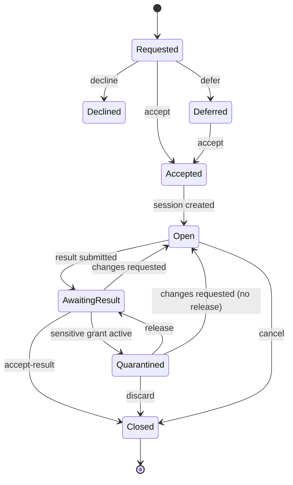

# Work sessions and results

Status: **draft** for Phase 2 (plan steps 2.1 and 2.6; used by 2.2–2.5 and the own-device
helper, D13). Ticket split: [../review/23-phase2-tickets.md](../review/23-phase2-tickets.md).
Change this document first.

> **Naming.** [session.md](session.md) is the Noise XX transport session (envelope types
> `session.*`, audit `session.open` / `session.reject`, in-memory only). That document and
> its names stay unchanged. The object specified here is a **work session**: the bounded,
> persisted piece of work that an accepted request becomes. Its id starts with `s-`, its
> mail kinds and audit actions start with `ws.`, and its IPC methods start with `ws_`. The
> CLI keeps the plan's words (`agentnet sessions`, `agentnet session <id>`), because users
> never see Noise sessions.

Conventions are those of [request.md](request.md): `<key>` is an identity key, wire times are
RFC 3339 UTC with `Z` and whole seconds, SQLite times carry milliseconds, bodies are
canonical JSON parsed strictly, optional members are absent (never `null`), and "no control
characters" means none of U+0000–U+001F and U+007F.

## Model

A request `r` from **A** (the *requester*) to **B** (the *worker*) becomes a work session
when B accepts it. The session carries the grants A gives B ([grant.md](grant.md)) and the
result B returns. It closes when A accepts the result, when either side cancels while the
work is open, or when A discards a quarantined result (OD-P2-6 (c)).

**Authority.** Two state machines exist, each with one authoritative owner:

| Record | Authoritative | Mirror | Transport |
|---|---|---|---|
| Request (`requests` row) | B, the recipient (unchanged, [request.md](request.md#lifecycle)) | A | `request.*` kinds with `seq` |
| Work session (`work_sessions` row) | **A, the requester** | B | `ws.state` with its own `seq` |

A decides every session state change because A owns everything the session depends on:
the grants, the quarantine and the acceptance of the result. B *submits* (a result, or a
cancel wish). A applies a submission when it is valid in A's current state, and tells B the
new state. This is the same one-writer-plus-`seq`-mirror pattern as requests, so no two
parties ever race on one record.

### Session id

The id is **derived**, so both daemons (and the requester's agent, right after it sends the
request) know it before any session mail exists:

```
sid = "s-" ‖ lowercase-hex( SHA-256("dorylinae-ws-id-v1\n" ‖ A ‖ "\n" ‖ B ‖ "\n" ‖ request_id)[0:16] )
```

`A`, `B` are the identity keys in wire form (43 ASCII characters), `request_id` is the
`r-…` id. One request has at most one session. A request id is unique per sender, and the
hash covers both keys, so session ids never collide across peers in practice (128 bits).

Vector (pairing vector keys: A = issuer seed `00…1f`, B = redeemer seed `20…3f`):

```
A          A6EHv_POEL4dcN0Y50vAmWfk1jCbpQ1fHdyGZBJVMbg
B          Kay64UG8yvCyLhqU000LxzYeUm0L_hLIl5S8kyKWbdc
request_id r-0123456789abcdef0123456789abcdef
sid        s-36375782ceb6baea9cee4d4273dfb035
```

## State machine

The session states and transitions are those of the plan's diagram (Phase 2), **extended by
two edges from `Quarantined` per OD-P2-6 (c)**. The first four states belong to the request;
the session starts at `Open`.



Mapping to stored states:

| Diagram | Stored where | Value |
|---|---|---|
| Requested | `requests.state` | `pending` |
| Deferred | `requests.state` | `deferred` |
| Declined | `requests.state` | `declined` (final, no session) |
| Accepted | `requests.state` | `accepted`; the session row is created **in the same transaction** as the accept, so `Accepted` is never observable without `Open` |
| Open | `work_sessions.state` | `open` |
| AwaitingResult | `work_sessions.state` | `awaiting_result` |
| Quarantined | `work_sessions.state` | `quarantined` |
| Closed | `work_sessions.state` | `closed`, with `outcome` = `accepted` or `cancelled` |

`request.cancel` (D11) is unchanged: it withdraws a request that is `pending` or `deferred`,
so it never meets a session. After accept the requester uses **session cancel** instead
(below). The Phase 1 rule "a cancel is refused after accept" therefore still holds for the
request; what the requester can do after accept is cancel the *session* while it is `open`.

### Transitions (authoritative, on A)

| From | Event | To | Who may cause it | Notes |
|---|---|---|---|---|
| (none) | `request.accept` applied on A | `open`, `round = 1` | B (accept) | B creates its mirror row in the accept transaction; A creates its row when it applies the accept, or when a `ws.result` for this request arrives first ([Ordering](#ordering)) |
| `open` | valid `ws.result` for the current `round` | `awaiting_result`, or `quarantined` if the [quarantine rule](#quarantine-24) holds | B | Stored result replaces any earlier one |
| `awaiting_result` | quarantine rule holds | `quarantined` | (daemon) | Evaluated in the same transaction as the result, so `awaiting_result` is not observable in between |
| `quarantined` | `release` (human-approved, [approval.md](approval.md)) | `awaiting_result` | A's human | The quarantine rule is not re-evaluated after a release for this round |
| `awaiting_result` | `accept-result` | `closed`, `outcome = accepted` | A | |
| `awaiting_result` | `request-changes` | `open`, `round += 1` | A | Carries a `changes` text for B |
| `open` | `cancel` (A), a valid `ws.cancel` from B, or an [early complete](#early-complete-and-phase-1-workers) from B | `closed`, `outcome = cancelled` | A or B | B's cancel is applied automatically by A's daemon when the state is `open`; otherwise refused |
| `quarantined` | `discard` | `closed`, `outcome = cancelled` | A | No approval. The stored result is deleted, never shown to A's IPC/agent (OD-P2-6 (c)) |
| `quarantined` | `request-changes` (without release) | `open`, `round += 1` | A | No approval. Carries a `changes` text for B; the stored result is deleted, never shown to A's IPC/agent (OD-P2-6 (c)) |

**Nothing else is reachable.** In particular: no cancel from `awaiting_result` (A either
accepts the result or requests changes), from `quarantined` A has four exits — `release`,
`discard`, `request-changes` (without release), or (after release) `accept-result`/
`request-changes` once back in `awaiting_result` — see OD-P2-6. No transition out of
`closed`, no `ws.result` outside `open`. Every other IPC action is `bad_state` with a
message naming the state. Every other peer mail is ignored and audited `ws.ignored {session,
peer, kind, reason}`.

For each transition, in **one transaction** on A: update the row (`state`, `seq += 1`,
`state_at`, `round`, `outcome`, `result`, `changes`), store the `ws.state` mail as
`last_state`, and `Outbox.SubmitTx` it to B. On `closed`, in the same transaction, every
grant of the session is ended ([grant.md §Session end](grant.md#session-end)).

### Mirror (on B)

On `ws.state` from `msg.from` = A:

1. Strict body ([Kinds](#kinds)); a failure is `mail.ErrBadBody`.
2. Find the `work_sessions` row `(sid)` with `role = worker` and `peer = msg.from`. None:
   ack, ignore, audit `ws.orphan {session, peer, kind}`.
3. `seq ≤ row.seq`: ignore (duplicate or out of order).
4. Otherwise copy `state`, `seq`, `round`, `outcome`, `changes`, `verification` (if
   present), `state_at`. B does **not**
   check the transition; A is authoritative and the higher `seq` wins.
5. If the new state is `closed`, B completes its request row ([Closing the
   request](#closing-the-request)).

After commit: audit `ws.state {session, peer, state, seq, round}` and [notify](notify.md).

### Closing the request

The request stays `accepted` while its session is not `closed`, so `request show` and the
inbox keep working, and the request view gains a `session` member ([IPC](#ipc)). When B's
mirror reaches `closed`, B's daemon, in the same transaction, moves its `in` row
`accepted → completed` exactly as `request_complete` does ([request.md](request.md#state-machine-authoritative-on-the-recipient)),
with:

- `outcome = accepted`: `result` = the D14 part of the accepted result (`status`, `summary`,
  `exit_code`, `output`, `artifacts`), and no `note`;
- `outcome = cancelled`: no `result`, and `note = "session cancelled"` (fixed text written by
  the daemon, never peer content).

The `request.complete` mail goes to A through the unchanged Phase 1 path, and A's mirror
applies it by `seq`. So the Phase 1 request record ends `completed` on both sides, and a
Phase 1 consumer that only reads requests still sees the final result.

### Early complete and Phase 1 workers

A Phase 2 worker sends `request.complete` only after the session is `closed`. A
`request.complete` from B that A applies while A's session for the request is **not**
`closed` is an **early complete**: B is a Phase 1 daemon (which knows no sessions), or B is
trying to deliver content past the quarantine. A's daemon, in the mail transaction:

1. applies it to the request mirror as in Phase 1 (`completed`, by `seq`), **except** that
   when the [quarantine rule](#quarantine-24) holds, the `result` and `note` are dropped and
   never stored (audit `ws.ignored {session, peer, kind: "request.complete", reason:
   "early_complete"}`), and the message's inbox copy is stored blank ([D18](#inbox-copy-d18));
2. if the session is `open`, closes it, `outcome = cancelled` (the diagram's `Open →
   Closed: cancel` edge, caused by B), ending its grants as for every close, and sends the
   `ws.state` as usual (a Phase 1 B acks it `unsupported`). In `awaiting_result` or
   `quarantined` (only a misbehaving Phase 2 B can cause this) the session is left to A.

So a Phase 1 worker still completes a Phase 2 requester's request (with its result when no
sensitive grant is involved), a session can never stay `open` with live grants after the
worker considers the work done, and no transition outside the diagram is added.

**Phase 1 requester.** When a `ws.*` mail from B to A ends `failed` with `unsupported_kind`
([mail.md](mail.md)), A is a Phase 1 daemon. B's daemon then, in one transaction, closes
its mirror locally (`outcome = cancelled`, audit `ws.close {…, outcome: "cancelled"}`) and
completes the request through the Phase 1 path: for a failed `ws.result`, with the D14 part
of that result and its `notes` as the `note`; for a failed `ws.cancel`, with no result and
`note = "session cancelled"`. Mixed Phase 1/Phase 2 teams therefore keep the Phase 1
behaviour, without grants or quarantine (a Phase 1 requester never issues grants).

**`request_complete` while a session exists** (`agentnet complete <id>` from Phase 1, used
by the snippet and harness): on a request whose session is `open`, it is **a shorthand for
`ws_result`** with the given `note` as `notes`, the D14 `result`, and `verification: none`
(a `result` without `status` is not possible, so `complete` without `--status` submits
`{"status": "n/a"}`). In any other session state it is `bad_state`. It never completes the
request directly once a session exists.

## Result object (2.6)

The plan's result (`session_id, summary, artifacts[], verification, notes`) and the D14
`request.complete` result (`status, summary, exit_code, output, artifacts`) are **one object**
here: the D14 result, extended by two members. Every D14 rule and cap is unchanged and
checked by the same `internal/request.ValidateComplete` code; `session_id` is not a member
because the carrying body names the session.

| Member | Req. | Type | Rules |
|---|---|---|---|
| `status` | yes | string | D14: `pass`, `fail`, `partial` or `n/a` |
| `summary` | no | string | D14: 1–280 code points, one line |
| `exit_code` | no | integer | D14 range |
| `output` | no | string | D14: 1–32768 bytes, `\n` and `\t` only as controls. For a consult this is the answer text |
| `artifacts` | no | array | D14: 1–20 request-shaped artifacts |
| `verification` | yes | string | `none` or `tests_passed`, as **claimed by B**. `human_accepted` is never sent by B: A records it locally ([Accept-result](#accept-result)) |
| `notes` | no | string | 1–2000 code points, `\n` and `\t` allowed (the same rule as the request `note`) |

The body of `ws.result` has a total cap of **65536 bytes** of canonical JSON
(`MaxResultBody`), checked after the member caps as for D14 (`result_too_large`). The result
is **data**: no daemon executes, fetches or acts on it, and it grants nothing. Its privacy
rules are those of [request.md §Result privacy](request.md#result-privacy): never in audit,
logs or webhooks; a desktop notification may show `status` only.

`verification: tests_passed` is B's claim, not proof. Views label it as such
(`"verification": "tests_passed"` plus `"verification_by": "worker"`).

### Accept-result

`agentnet accept-result <session>` (A only): `awaiting_result → closed`, `outcome =
accepted`. With `--human`, the daemon first requires a [human approval](approval.md) (kind
`accept_result`); on success the session's stored `verification` becomes `human_accepted`
(`verification_by: "requester"`). Without `--human`, the claimed value stays. The `ws.state`
to B carries the final `verification`.

### Request changes

`agentnet session <id> --request-changes "<text>"` (A only): `awaiting_result → open`, or
`quarantined → open` **without a release** (OD-P2-6 (c)), `round += 1`, `changes` = the text
(1–4000 code points, `\n` and `\t` allowed, content: never audited). B's agent reads it with
`agentnet session <id>` and submits a new result for the new round. From `quarantined`, the
quarantined result is deleted unseen ([Quarantine](#quarantine-24)); B is told only `open`
with the round and `changes`, never that a result existed or what it was.

### Discard

`agentnet session <id> --discard` (A only): `quarantined → closed`, `outcome = cancelled`
(OD-P2-6 (c)). No approval. The stored result is deleted unseen, never shown to A's IPC or
agent, and never stored beyond the transaction that deletes it. B is told only `closed` /
`cancelled`, the same as any other cancelled close; B learns nothing about A's view of the
content. This is the diagram's `Quarantined → Closed: discard` edge — a human who distrusts a
quarantined result can get rid of it without exposing it to the agent the quarantine
protects.

## Quarantine (2.4)

The **quarantine rule** holds for a result when **either**:

1. the session has **any grant with `sensitive: true` that was ever active in this session**
   ([grant.md](grant.md)), whether it is still active, expired or revoked (a grant that was
   never approved gave no access and does not count); or
2. A issued **any** sensitive grant to the same peer B, in any session, whose `exp` is later
   than `now − 7 d` (so B cannot read through a grant in session S1 and return the data in
   a grant-less session S2 or a consult).

Using "ever active" rather than "active" means B cannot dodge the quarantine by waiting for
the grant to expire or asking A to revoke it before submitting.

Interpretation of the plan: "the session's outgoing artifacts" are what the session sends
back to the requester's side, that is, B's result. While `quarantined`:

- A's daemon stores the result, but `ws_show`, `ws_list`, `request_show` and `wait` on A
  return **only its sizes** (`result_bytes`, `output_bytes`, `artifacts` count) and
  `status`, never the summary, output, artifacts or notes. The requester's agent therefore
  cannot read the **session result** until a human looked at the session and released it.
- **Side doors in the same request are closed too.** While the quarantine rule holds for the
  session (from the first sensitive grant until `closed`):
  - a `request.complete` from B for this request that arrives while A's session is not
    `closed` is an **early complete** ([Early complete](#early-complete-and-phase-1-workers)):
    its `result` and `note` are dropped unread, never stored;
  - the `reason` of a `ws.cancel` from B is not stored or shown on A (the cancel itself is
    applied as usual).
- **What it does not cover.** B can still send A **new** mail with content: a new request or
  consult (brief, title, context), or the notes of B's replies to A's other requests. Those
  are ordinary untrusted peer text, exactly as in Phase 1, and are not quarantined in Phase 2
  (OD-P2-15).
- `agentnet release <session>` requires a [human approval](approval.md) (kind `release`).
  On approval: `quarantined → awaiting_result`, audit `ws.release {session, peer, round,
  approval}`, `ws.state` to B. The result then becomes visible.
- **Leaving `quarantined` without a release (OD-P2-6 (c)):** `discard` and `request-changes`
  need no approval, because both **reduce** exposure — neither shows the quarantined result
  to A's IPC or agent. In the same transaction as the state change, the stored `result` (and
  `result_round`) are deleted and never re-derivable; nothing computed from the content
  survives the transaction.
  <a id="inbox-copy-d18"></a>**The inbox copy too (D18).** The receiver also keeps each
  message's signed plaintext in `mail_inbox.signed`. The receiver inserts that row **after**
  the kind's `Apply` in the same transaction (`internal/mail/receiver.go`), and the row
  carries no session or round, so the copy is not blanked afterwards: it is **stored blank
  (`''`) at receipt** whenever `Apply` marks the message's content as withheld or dropped
  (review 29, H1). That covers (1) a `ws.result` that enters `quarantined`; (2) a `ws.result`
  that is ignored (`ws.ignored`, wrong state or round, closed session); (3) a
  `request.complete` whose content is dropped as an [early
  complete](#early-complete-and-phase-1-workers); (4) a `ws.cancel` while the quarantine rule
  holds (its `reason` is not stored). Discard and request-changes then have no inbox row to
  touch. The row itself stays, so `(from_key, id)` still deduplicates a redelivery (which is
  acked and not applied again), and the `kind`, `created` and `received_at` metadata stays
  too. A released result keeps no signed copy; its content lives in the session row.
  Nothing reads `mail_inbox.signed` back after the message is applied. A test searches every
  table for the quarantined result's bytes after receipt, after discard, after
  request-changes without release, after a stale-round `ws.result`, and after a dropped
  early complete. B is told only the new `ws.state` (`closed`/`cancelled`, or `open`
  with the new `round` and `changes`) — the same shape B would see from an ordinary
  request-changes or cancel, so B learns nothing about whether A's human ever saw the
  content. Audited as `ws.discard {session, peer, round}` or `ws.request_changes {session,
  peer, round, from: "quarantined"}` — no content, matching every other audit row in this
  document.
- The plan's acceptance test: a session with a sensitive grant cannot deliver a result until
  released, and the audit log records the release.

What the quarantine does **not** do: it cannot stop B's human or agent from copying data
elsewhere (B had read access; see [grant.md §Threat model](grant.md#threat-model)), and it
does not hold back B's other mail (above). It is a gate on the requester's side for the
**result the requester asked for**, which the requester's agent is most inclined to trust
and act on, against a worker (or a prompt-injected worker agent) pushing exfiltration
instructions, links or poisoned content into it.
The release decision in Phase 2 is taken on metadata (sizes and status) plus whatever the
human learns outside AgentNet; a human-only preview is OD-P2-7.

## Cancel

- **A**: `agentnet session <id> --cancel [--reason R]` in state `open` → `closed`,
  `outcome = cancelled`. Otherwise `bad_state`.
- **B**: the same command sends `ws.cancel {at, session, request, reason?}`. B's row does not
  change until A's `ws.state` arrives. A's daemon applies it automatically when its state
  is `open` (audit `ws.cancel_in {session, peer, result: "cancelled"}`), and otherwise
  ignores it (`result: "refused"`) and re-sends its `last_state`, so B learns the real
  state. B's `ws_show` shows `cancel: "requested"` meanwhile, like the request mirror.
- `reason` is 1–500 code points, content, never audited.
- A cancel refunds nothing and changes no urgency counts (D12).

## Kinds

All are sealed [mail](mail.md), outboxed, acked, registered with `Inbox: true` (the signed
plaintext is proof), and strict. A validation failure is `mail.ErrBadBody`.

| Kind | Direction | Body | Rules |
|---|---|---|---|
| `ws.result` | B → A | `{"at", "request", "result", "round", "session"}` | `session` = the derived id for `(msg.to, msg.from, request)` (else `bad_body`); `round` ≥ 1; `result` per [Result object](#result-object-26); total ≤ 65536 bytes |
| `ws.state` | A → B | `{"at", "changes"?, "outcome"?, "request", "round", "seq", "session", "state", "verification"?}` | `state` ∈ `open`, `awaiting_result`, `quarantined`, `closed`; `outcome` present iff `state = closed`; `changes` only with `state = open` and `round ≥ 2`; `verification` only with `outcome = accepted`; `session` = the derived id for `(msg.from, msg.to, request)` |
| `ws.cancel` | B → A | `{"at", "reason"?, "request", "session"}` | as above |

The derived-id check on every kind binds each body to its request and to the two parties, so
a body cannot be moved to another session.

`ws.result` receive steps on A (inside the mail dedupe transaction):

1. Strict body, caps, derived id.
2. Find the `out` request row `(peer = msg.from, id = request)`. None: ack, ignore, audit
   `ws.orphan`. The row's mirror state may still be `pending` or `deferred` if the
   `request.accept` has not arrived yet ([Ordering](#ordering)); `declined`, `cancelled`
   or `completed`: ignore, audit `ws.ignored`.
3. Find or create the session row (`open`, `round = 1`, `seq = 0`).
4. State must be `open` and `round` must equal the row's `round`; otherwise ignore and audit
   `ws.ignored {reason: "state"|"round"}`, and re-send `last_state` (10-minute rule as for
   requests), so a B that missed a `ws.state` catches up.
5. Apply the transition ([Transitions](#transitions-authoritative-on-a)).

After commit: audit `ws.result_in {session, peer, round, result_bytes, output_bytes,
artifacts, quarantined}`, and notify `session.quarantined` when the result entered
quarantine, or `session.result` when it did not (see [Notifications](#notifications)).

### Ordering

Mail can overtake mail. A `ws.result` may reach A before the `request.accept`; step 3
creates the session. A `ws.state` may reach B for a session B does not know only if B's
database was lost; it is an orphan. A `request.accept` that arrives after the session row
exists creates nothing new.

## Grants in a session

A session is the **binding** of every grant: a grant names its `session`, is usable only
while that session is `open`, and ends when the session closes
([grant.md](grant.md#session-end)). Only A (the requester) issues grants in a session
(OD-P2-5).

## Persistence

```sql
-- migration 14 (2.1a): work_sessions
CREATE TABLE work_sessions (
    id            TEXT PRIMARY KEY,                  -- s-<32 hex>, derived
    role          TEXT NOT NULL CHECK (role IN ('requester', 'worker')),
    peer          TEXT NOT NULL,                     -- the other party
    request_id    TEXT NOT NULL,                     -- r-<32 hex>
    team_id       TEXT NOT NULL,
    state         TEXT NOT NULL CHECK (state IN ('open', 'awaiting_result', 'quarantined', 'closed')),
    outcome       TEXT CHECK (outcome IN ('accepted', 'cancelled')),
    seq           INTEGER NOT NULL DEFAULT 0,        -- A: last ws.state sent; B: last applied
    round         INTEGER NOT NULL DEFAULT 1,
    result        TEXT CHECK (result IS NULL OR json_valid(result)),  -- canonical result of the current round
    result_round  INTEGER,
    verification  TEXT CHECK (verification IN ('none', 'tests_passed', 'human_accepted')),
    changes       TEXT,                              -- last request-changes text (content)
    cancel        TEXT CHECK (cancel IN ('requested', 'refused')),     -- B only
    released      INTEGER NOT NULL DEFAULT 0,        -- A: 1 once the current round was released
    last_state    TEXT CHECK (last_state IS NULL OR json_valid(last_state)),  -- A: {"kind","body"}
    last_state_sent TEXT,
    opened        TEXT NOT NULL,
    state_at      TEXT NOT NULL,
    closed        TEXT,
    updated       TEXT NOT NULL,
    CHECK ((state = 'closed') = (outcome IS NOT NULL))
);
CREATE INDEX work_sessions_state ON work_sessions (state);
CREATE UNIQUE INDEX work_sessions_request ON work_sessions (role, peer, request_id);
```

Rows are kept indefinitely in Phase 2 (they are the data for the 3.7 experience record).
`peers remove` does not delete them; a session with a removed peer can no longer change
(every mail from that key is `unpaired`), and A may still cancel it locally, which ends its
grants. Migration 14 must be added to the DROP lists of **both** rewind tests in
`internal/store/store_test.go` (`TestMigration8PreservesPeers`, `TestMigrationAddsPeerTrust`).

## IPC

Every method returns within 2 s and never waits for the relay or a peer.

**Session view:**

```json
{
  "id": "s-…", "role": "requester"|"worker", "peer": <peer ref>, "team": {"id", "name"},
  "request": {"id": "r-…", "type", "title"}, "state", "outcome"?, "round", "seq",
  "opened", "state_at", "closed"?,
  "result"?: {<result object>, "output_bytes", "result_bytes"},
  "quarantine"?: {"status", "result_bytes", "output_bytes", "artifacts"},
  "verification"?, "verification_by"?: "worker"|"requester",
  "changes"?, "cancel"?: "requested"|"refused",
  "grants": [<grant summary>]
}
```

`result` is absent while `quarantined` on A (then `quarantine` is present). List views omit
`result.output`, `result.notes` and `changes`, and keep the sizes.

| Method | Params | Result / errors |
|---|---|---|
| `ws_list` | `{"state"?, "role"?, "peer"?, "team"?}` | `{"sessions": [<list view>]}`, newest `state_at` first |
| `ws_show` | `{"id"}` (an `s-` id, or an `r-` id resolved through its session) | `{"session": <view>}`. `unknown_session` |
| `ws_result` | `{"id", "result", "notes"?}` (B only) | `{"session": <view>, "mail_id"}`. `bad_state` unless B's mirror is `open` (and `cancel` not requested), or the id names a `pending`/`deferred` request of type `question`, which is accepted in the same call ([consult.md §Answering](consult.md#answering)); `bad_request` naming the field; `result_too_large`; `not_worker` |
| `ws_accept_result` | `{"id", "human"?: bool}` (A only) | `{"session": <view>, "mail_id"}` or, with `human`, `{"approval": <approval view>}` ([approval.md](approval.md)). `bad_state`, `not_requester` |
| `ws_request_changes` | `{"id", "changes"}` (A only) | `{"session", "mail_id"}`. `bad_state` unless `awaiting_result` or `quarantined` (from `quarantined`, no approval, per OD-P2-6 (c)); `bad_request`, `not_requester` |
| `ws_discard` | `{"id"}` (A only) | `{"session", "mail_id"}`. No approval. `bad_state` unless `quarantined`; `not_requester` (OD-P2-6 (c)) |
| `ws_cancel` | `{"id", "reason"?}` | A: `{"session", "mail_id"}`; B: `{"session", "mail_id", "duplicate"}`. `bad_state` |
| `ws_release` | `{"id"}` (A only) | `{"approval": <approval view>}`; the release happens when the approval is confirmed. `bad_state` unless `quarantined` |

New error codes: `unknown_session`, `not_requester`, `not_worker` (exit 1).

The **request view** ([ipc.md](ipc.md#requests)) gains `"session"?: {"id", "state",
"round"}` once a session exists.

## CLI

Per-command pages (`Docs/cli/session.md`) are written by ticket 2.1b.

| Command | IPC | Notes |
|---|---|---|
| `agentnet sessions [--state S] [--role requester\|worker] [--json]` | `ws_list` | |
| `agentnet session <id> [--json]` | `ws_show` | `<id>` is `s-…` or `r-…` |
| `agentnet session <id> --request-changes TEXT \| --changes-from-file F` | `ws_request_changes` | Also allowed from `quarantined`, without a release (OD-P2-6 (c)) |
| `agentnet session <id> --discard` | `ws_discard` | `quarantined` only; no approval (OD-P2-6 (c)) |
| `agentnet session <id> --cancel [--reason R]` | `ws_cancel` | |
| `agentnet result <id> --status S [--summary T] [--file F \| --output-from-file F] [--exit-code N] [--artifact SPEC]… [--verification none\|tests_passed] [--notes T] [--json]` | `ws_result` | `--file` is the plan's name and is the same as `--output-from-file` (CRLF → LF, ANSI CSI stripped, other controls rejected, `-` = stdin, as `agentnet complete` in 1.6b). For a consult, `--status` defaults to `n/a` ([consult.md](consult.md)) |
| `agentnet wait <id> [--timeout SECONDS] [--json]` | polls `ws_show` | See below |
| `agentnet accept-result <id> [--human] [--json]` | `ws_accept_result` | |
| `agentnet release <id> [--json]` | `ws_release` | Prints the approval id; the code arrives by desktop notification |

**`wait`** is the one command that deliberately blocks beyond 2 s; it is a CLI-side loop and
every IPC call in it returns in under 2 s. It polls `ws_show` (or, before the session
exists, `request_show` of the request the derived id belongs to) once per second until one of:

| Condition (as seen by the caller's side) | Exit | `--json` `"wait"` |
|---|---|---|
| A: `awaiting_result` (result visible) or `closed` | 0 | `"result"` / `"closed"` |
| B: the state changed from the one at start (for example `open` after changes requested, or `closed`) | 0 | `"changed"` |
| the request was `declined` or `cancelled` | 0 | `"declined"` / `"cancelled"` |
| timeout (default 300 s, max 3600 s) | 4 | `"timeout"` (with the current view, which shows `quarantined` if so) |

Exit 1 error, 2 usage, 3 daemon not running, as for every command. The `--json` output is
`{"ok": true, "wait": "<reason>", "session": <view>}`, and the result is included in full
(with `output`) when visible, so a consulting agent needs one command.

## Notifications

Events for [notify.md](notify.md) (the `notify.events` setting), all on by default and
content-free (D25):

- `session.quarantined` (A): "<name>'s result is quarantined and waits for your release" (no
  title, no status).
- `session.result` (A): "<name>'s result is ready for your review", body = the request title
  (the requester's own text). Fired once, after commit, when a `ws.result` for the current
  round is applied **without** quarantine (`awaiting_result`). Not fired for a quarantined
  result (`session.quarantined` covers it), nor after a release (the human who approved the
  release already knows), nor for an ignored or orphan result. A later round's result fires it
  again.
- `session.changes` (B): "<name> asked for changes", body = the request title (cleaned: it is
  the peer's text on B). Fired once, after commit, when a `ws.state` starts a new round with a
  `changes` text; never for a duplicate `ws.state`. The `changes` text is never shown.

A completed or cancelled session is reported through the existing request-level events
(`request.completed`, `request.cancelled`). Webhooks carry the event name, request id, peer
and (with `title: true`) the request title only; never result content, `changes` or reasons.

## Audit

Never titles, results, notes, changes or reasons. Only ids, enums, counts and sizes.

| Action | Side / actor | Detail |
|---|---|---|
| `ws.open` | both / `daemon` (B: `cli`) | `{session, request, peer, role}` |
| `ws.result` | B / `cli` | `{session, peer, round, result_bytes, output_bytes, artifacts, verification}` |
| `ws.result_in` | A / `daemon` | `{session, peer, round, result_bytes, output_bytes, artifacts, quarantined}` |
| `ws.release` | A / `cli` | `{session, peer, round, approval}` |
| `ws.accept_result` | A / `cli` | `{session, peer, round, verification}` |
| `ws.request_changes` | A / `cli` | `{session, peer, round, from?}` (`from: "quarantined"` when it left `quarantined` without a release, OD-P2-6 (c)) |
| `ws.discard` | A / `cli` | `{session, peer, round}` (no content; OD-P2-6 (c)) |
| `ws.cancel` | either / `cli` | `{session, peer, role}` |
| `ws.cancel_in` | A / `daemon` | `{session, peer, result}` |
| `ws.state` | B / `daemon` | `{session, peer, state, seq, round}` |
| `ws.close` | A / `daemon` | `{session, peer, outcome, rounds, age_s}` (`age_s` since `opened`: the time-to-result metric) |
| `ws.ignored`, `ws.orphan` | either / `daemon` | `{session, peer, kind, reason?}` |

`verification` and `outcome` are enums the daemon sets from a closed set; the result's
`status` and `exit_code` stay out of audit as in D14.

## Security considerations

- **Authority.** A session grants nothing by itself. Authority comes only from grant tokens
  ([grant.md](grant.md)); a result, `changes` text, notes or a brief never cause the daemon
  to act.
- **One writer per record** (A for sessions, B for requests) and `seq` ordering remove
  cross-party races; a modified peer can only send bodies that A validates against its own
  state (wrong round, wrong state → ignored).
- **Binding.** The derived session id is checked on every kind, so a body cannot be replayed
  into another session or pair. Mail dedupe and the 14-day receive age limit apply as for
  every kind.
- **Quarantine** is a requester-side gate ([above](#quarantine-24)); it does not claim to
  prevent exfiltration by the worker.
- **Resource use.** One session per request; the request caps already bound how many
  requests arrive. `ws.result` is capped at 64 KiB. `last_state` echoes follow the 10-minute
  rule, so a peer cannot make A send unbounded mail.
- **Version skew.** A Phase 1 daemon acks `ws.*` as `unsupported`, and both directions fall
  back to the Phase 1 request behaviour ([Early complete](#early-complete-and-phase-1-workers)).
  Grants, quarantine, consult context and helper `run` need both sides on Phase 2 (a Phase 1
  daemon refuses `context`/`run` requests as `bad_body`); this is a documented beta
  limitation (added to `Docs/beta/known-limitations.md` by 2.1a).

## Error codes (summary)

`unknown_session`, `not_requester`, `not_worker`, `bad_state`, `bad_request`,
`result_too_large`, plus the approval codes of [approval.md](approval.md) for
`--human` and `release`.
