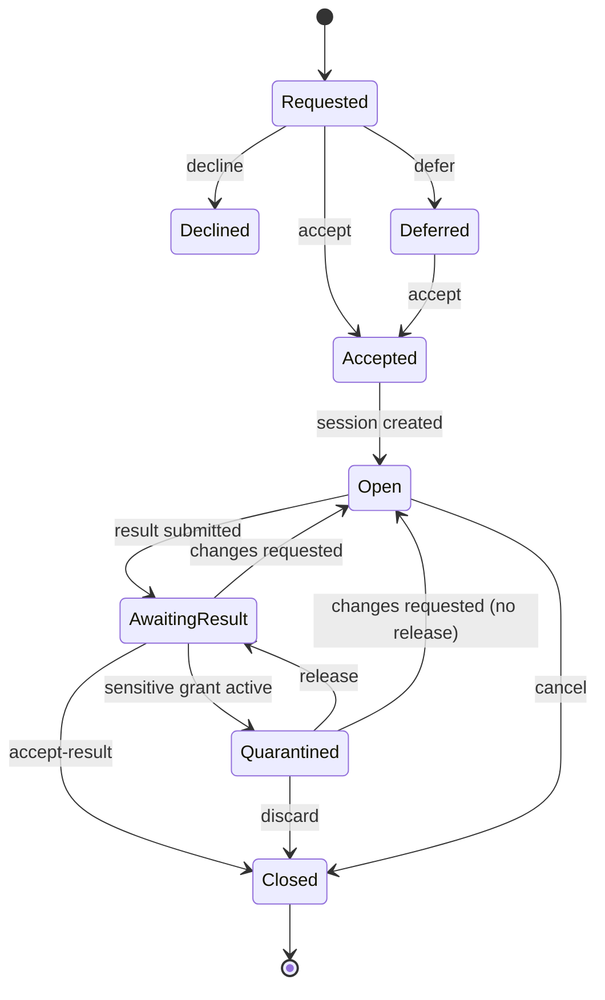

# Work sessions and results

Status: **draft** for Phase 2 (plan steps 2.1 and 2.6; used by 2.2–2.5 and the own-device
helper, D13). Ticket split: [../review/23-phase2-tickets.md](../review/23-phase2-tickets.md).
Change this document first.

> **Naming.** [session.md](session.md) is the Noise XX transport session (envelope types
> `session.*`, audit `session.open` (and `session.reject` before R55-F14), in-memory only). That document and
> its names stay unchanged. The object specified here is a **work session**: the bounded,
> persisted piece of work that an accepted request becomes. Its id starts with `s-`, its
> mail kinds and audit actions start with `ws.`, and its IPC methods start with `ws_`. The
> CLI keeps the plan's words (`agentnet sessions`, `agentnet session <id>`), because users
> never see Noise sessions.

Conventions are those of [request.md](request.md): `<key>` is an identity key, wire times are
RFC 3339 UTC with `Z` and whole seconds, SQLite times carry milliseconds, bodies are
canonical JSON parsed strictly, optional members are absent (never `null`), and "no control
characters" means none of U+0000–U+001F and U+007F.

## Model

A request `r` from **A** (the *requester*) to **B** (the *worker*) becomes a work session
when B accepts it. The session carries the grants A gives B ([grant.md](grant.md)) and the
result B returns. It closes when A accepts the result, when either side cancels while the
work is open, or when A discards a quarantined result (OD-P2-6 (c)).

**Authority.** Two state machines exist, each with one authoritative owner:

| Record | Authoritative | Mirror | Transport |
|---|---|---|---|
| Request (`requests` row) | B, the recipient (unchanged, [request.md](request.md#lifecycle)) | A | `request.*` kinds with `seq` |
| Work session (`work_sessions` row) | **A, the requester** | B | `ws.state` with its own `seq` |

A decides every session state change because A owns everything the session depends on:
the grants, the quarantine and the acceptance of the result. B *submits* (a result, or a
cancel wish). A applies a submission when it is valid in A's current state, and tells B the
new state. This is the same one-writer-plus-`seq`-mirror pattern as requests, so no two
parties ever race on one record.

### Session id

The id is **derived**, so both daemons (and the requester's agent, right after it sends the
request) know it before any session mail exists:

```
sid = "s-" ‖ lowercase-hex( SHA-256("dorylinae-ws-id-v1\n" ‖ A ‖ "\n" ‖ B ‖ "\n" ‖ request_id)[0:16] )
```

`A`, `B` are the identity keys in wire form (43 ASCII characters), `request_id` is the
`r-…` id. One request has at most one session. A request id is unique per sender, and the
hash covers both keys, so session ids never collide across peers in practice (128 bits).

Vector (pairing vector keys: A = issuer seed `00…1f`, B = redeemer seed `20…3f`):

```
A          A6EHv_POEL4dcN0Y50vAmWfk1jCbpQ1fHdyGZBJVMbg
B          Kay64UG8yvCyLhqU000LxzYeUm0L_hLIl5S8kyKWbdc
request_id r-0123456789abcdef0123456789abcdef
sid        s-36375782ceb6baea9cee4d4273dfb035
```

## State machine

The session states and transitions are those of the plan's diagram (Phase 2), **extended by
two edges from `Quarantined` per OD-P2-6 (c)**. The first four states belong to the request;
the session starts at `Open`.


```mermaid
stateDiagram-v2
    [*] --> Requested
    Requested --> Accepted: accept
    Requested --> Declined: decline
    Requested --> Deferred: defer
    Deferred --> Accepted: accept
    Accepted --> Open: session created
    Open --> AwaitingResult: result submitted
    AwaitingResult --> Quarantined: sensitive grant active
    Quarantined --> AwaitingResult: release
    AwaitingResult --> Closed: accept-result
    AwaitingResult --> Open: changes requested
    Quarantined --> Closed: discard
    Quarantined --> Open: changes requested (no release)
    Open --> Closed: cancel
    Closed --> [*]
```

Mapping to stored states:

| Diagram | Stored where | Value |
|---|---|---|
| Requested | `requests.state` | `pending` |
| Deferred | `requests.state` | `deferred` |
| Declined | `requests.state` | `declined` (final, no session) |
| Accepted | `requests.state` | `accepted`; the session row is created **in the same transaction** as the accept, so `Accepted` is never observable without `Open` |
| Open | `work_sessions.state` | `open` |
| AwaitingResult | `work_sessions.state` | `awaiting_result` |
| Quarantined | `work_sessions.state` | `quarantined` |
| Closed | `work_sessions.state` | `closed`, with `outcome` = `accepted` or `cancelled` |

`request.cancel` (D11) is unchanged: it withdraws a request that is `pending` or `deferred`,
so it never meets a session. After accept the requester uses **session cancel** instead
(below). The Phase 1 rule "a cancel is refused after accept" therefore still holds for the
request; what the requester can do after accept is cancel the *session* while it is `open`.

### Transitions (authoritative, on A)

| From | Event | To | Who may cause it | Notes |
|---|---|---|---|---|
| (none) | `request.accept` applied on A | `open`, `round = 1` | B (accept) | B creates its mirror row in the accept transaction; A creates its row when it applies the accept, or when a `ws.result` for this request arrives first ([Ordering](#ordering)) |
| `open` | valid `ws.result` for the current `round` | `awaiting_result`, or `quarantined` if the [quarantine rule](#quarantine-24) holds | B | Stored result replaces any earlier round's one. B submits **at most one** result per round ([`ws_result`](#ipc), R55-F18); if a modified B sends two, A applies whichever arrives first and ignores the other (`reason: "state"`), and A's request record still holds the result A accepted ([Closing the request](#closing-the-request)) |
| `awaiting_result` | quarantine rule holds | `quarantined` | (daemon) | Evaluated in the same transaction as the result, so `awaiting_result` is not observable in between |
| `quarantined` | `release` (human-approved, [approval.md](approval.md)) | `awaiting_result` | A's human | The quarantine rule is not re-evaluated after a release for this round |
| `awaiting_result` | `accept-result` | `closed`, `outcome = accepted` | A | |
| `awaiting_result` | `request-changes` | `open`, `round += 1` | A | Carries a `changes` text for B |
| `open` | `cancel` (A), a valid `ws.cancel` from B, or an [early complete](#early-complete-and-phase-1-workers) from B | `closed`, `outcome = cancelled` | A or B | B's cancel is applied automatically by A's daemon when the state is `open`; otherwise refused |
| `quarantined` | `discard` | `closed`, `outcome = cancelled` | A | No approval. The stored result is deleted, never shown to A's IPC/agent (OD-P2-6 (c)) |
| `quarantined` | `request-changes` (without release) | `open`, `round += 1` | A | No approval. Carries a `changes` text for B; the stored result is deleted, never shown to A's IPC/agent (OD-P2-6 (c)) |

**Nothing else is reachable.** In particular: no cancel from `awaiting_result` (A either
accepts the result or requests changes), from `quarantined` A has four exits — `release`,
`discard`, `request-changes` (without release), or (after release) `accept-result`/
`request-changes` once back in `awaiting_result` — see OD-P2-6. No transition out of
`closed`, no `ws.result` outside `open`. Every other IPC action is `bad_state` with a
message naming the state. Every other peer mail is ignored and audited `ws.ignored {session,
peer, kind, reason}`.

For each transition, in **one transaction** on A: update the row (`state`, `seq += 1`,
`state_at`, `round`, `outcome`, `result`, `changes`), store the `ws.state` mail as
`last_state`, and `Outbox.SubmitTx` it to B. On `closed`, in the same transaction, every
grant of the session is ended ([grant.md §Session end](grant.md#session-end)).

### Mirror (on B)

On `ws.state` from `msg.from` = A:

1. Strict body ([Kinds](#kinds)); a failure is `mail.ErrBadBody`.
2. Find the `work_sessions` row `(sid)` with `role = worker` and `peer = msg.from`. None:
   ack, ignore, audit `ws.orphan {session, peer, kind}`.
3. `seq ≤ row.seq`: ignore (duplicate or out of order). **Except** (R55-F18, review 55
   R55-114): if `seq = row.seq` (an echo of the state B already has), `row.cancel =
   'requested'` and the echoed `state` is `awaiting_result` or `quarantined`, set
   `row.cancel = 'refused'`. A applies a `ws.cancel` only in `open`, and it re-sends
   `last_state` when it refuses one, so such an echo is A's refusal ([Cancel](#cancel)).
   An older `seq` (a reordered mail) is not an echo and changes nothing (review 69b F4).
   Else, if the row is already `closed`: ignore, audit `ws.ignored {session, peer, kind,
   reason: "closed"}`. Closed is final on B too, so a later state can neither reopen the
   mirror nor close it a second time (review 55 R55-067).
4. Otherwise copy `state`, `seq`, `round`, `outcome`, `changes`, `verification` (if
   present), `state_at`. B does **not**
   check the transition otherwise; A is authoritative and the higher `seq` wins. The `cancel` mark
   (R55-F18): new state `closed` or `open` → `cancel` = NULL (the wish is answered, or a new
   round started); new state `awaiting_result` or `quarantined` while `cancel = 'requested'`
   → `cancel = 'refused'`.
5. If the new state is `closed`, B completes its request row ([Closing the
   request](#closing-the-request)).

After commit: audit `ws.state {session, peer, state, seq, round}` and [notify](notify.md).

### Closing the request

The request stays `accepted` while its session is not `closed`, so `request show` and the
inbox keep working, and the request view gains a `session` member ([IPC](#ipc)). When B's
mirror reaches `closed`, B's daemon, in the same transaction, moves its `in` row
`accepted → completed` exactly as `request_complete` does ([request.md](request.md#state-machine-authoritative-on-the-recipient)),
with:

- `outcome = accepted`: `result` = the D14 part of the accepted result (`status`, `summary`,
  `exit_code`, `output`, `artifacts`), and no `note`;
- `outcome = cancelled`: no `result`, and `note = "session cancelled"` (fixed text written by
  the daemon, never peer content).

B's stored result is always the one A accepted, because B submits at most one result per
round (the [`ws_result`](#ipc) rule, R55-F18) and drops its copy whenever a round ends
without acceptance ([Mirror](#mirror-on-b) step 4).

The `request.complete` mail goes to A through the unchanged Phase 1 path, and A's mirror
applies it by `seq`. So the Phase 1 request record ends `completed` on both sides, and a
Phase 1 consumer that only reads requests still sees the final result.

**A stores its own view of the close (R55-F18, review 55 R55-022).** When A applies a
`request.complete` for a request whose requester session is already `closed`, A does **not**
store what B sent. A derives the request record's `result` and `note` from its own session:

- `outcome = accepted`: `result` = the D14 part of A's stored accepted result, no `note`.
  This is the result A's agent or human actually reviewed, even if B sent another one.
- `outcome = cancelled`: no `result`, `note = "session cancelled"` (the fixed text).

The `state`, `seq` and `state_at` still come from the mail, by `seq` as before. When the
mirror **applies** the mail (its `seq` is higher) and B's `result` or `note` differs from
what A stores (compared as canonical JSON), A audits `ws.ignored {session, peer, kind:
"request.complete", reason: "result_mismatch"}`. A mail ignored by `seq` is not audited
this way.

The same rule applies in the other order (review 69b F1). A modified B can send
`request.complete` while A's session is `awaiting_result` or `quarantined`, before A
decides. The request record is then `completed` with no content ([Early
complete](#early-complete-and-phase-1-workers) step 2). When A later closes that session
(accept-result, discard, or cancel after a request for changes), the close transaction
also writes A's view into the request record while it is `completed`, as above. So
whichever arrives second, B's `request.complete` or A's close, the record ends with what A
accepted. The
message's inbox copy follows the existing rule: it is stored blank only when the
[quarantine rule](#quarantine-24) holds ([D18](#inbox-copy-d18)). A released and accepted
result is A's own reviewed copy, so A stores it in the request record even when the rule
holds. Before R55-F18, A stored B's content. An unmodified B that revised its answer, or any
modified B, could then put a result that nobody reviewed into A's request record (C21-01).

### Early complete and Phase 1 workers

A Phase 2 worker sends `request.complete` only after the session is `closed`. A
`request.complete` from B that A applies while A's session for the request is **not**
`closed` is an **early complete**: B is a Phase 1 daemon (which knows no sessions), or B is
trying to deliver content past the quarantine. A's daemon, in the mail transaction:

1. applies it to the request mirror as in Phase 1 (`completed`, by `seq`), **except** that
   when the [quarantine rule](#quarantine-24) holds, the `result` and `note` are dropped and
   never stored (audit `ws.ignored {session, peer, kind: "request.complete", reason:
   "early_complete"}`), and the message's inbox copy is stored blank ([D18](#inbox-copy-d18));
2. if the session is `open`, closes it, `outcome = cancelled` (the diagram's `Open →
   Closed: cancel` edge, caused by B), ending its grants as for every close, and sends the
   `ws.state` as usual (a Phase 1 B acks it `unsupported`). If the session is past round 1
   (A applied a `ws.result` from B in it, so B is Phase 2 here), B's `result` and `note`
   are **not stored**: the record gets A's view of the cancelled close (no `result`,
   `note = "session cancelled"`), the inbox copy is stored blank, and the drop is audited
   `ws.ignored {…, reason: "early_complete"}` when B sent content (review 78 S1, owner
   decision). Only a round-1 session that never applied a `ws.result` keeps the Phase 1
   behaviour: a Phase 1 B never sends one. In `awaiting_result` or
   `quarantined` (only a misbehaving Phase 2 B can cause this) the session is left to A.
   In that case, B's `result` and `note` are **not stored** in the request record
   (R55-F18, review 69b F1), whether or not the quarantine rule holds. A result is under
   review, so B's copy would compete with it. A writes its own view into the record when
   it closes the session ([Closing the request](#closing-the-request)). This is audited
   `ws.ignored {…, reason: "early_complete"}` when content was dropped.

**Late decline or cancelled (R55-F18, review 55 R55-062).** A `request.decline` or
`request.cancelled` from B with a higher `seq` can move A's mirror out of `accepted` after a
session exists. Only a modified B sends one: a Phase 2 B has no decline or cancel after
accept. A's daemon applies it to the request mirror as before and then, in the same
transaction, treats the session like an early complete step 2: if the session is `open`, A
closes it with `outcome = cancelled` (a debate session closes through the debate, as for an
early complete), ends its grants, and sends the `ws.state`. In `awaiting_result` or
`quarantined` the session is left to A. Grants are usable only while `open`, so none stays
live. Before R55-F18 the session stayed `open` with live grants while `request show` said
`declined`.

So a Phase 1 worker still completes a Phase 2 requester's request (with its result when no
sensitive grant is involved), a session can never stay `open` with live grants after the
worker considers the work done or the request ended, and no transition outside the diagram
is added.

**Phase 1 requester.** When a `ws.result` or `ws.cancel` from B to A ends `failed` with
`unsupported_kind` ([mail.md](mail.md#ack)), A is a Phase 1 daemon. Only the ack's
`unsupported` member means that. A bad body or a mail refused by the receive age limit is
acked under `rejected` and ends `failed` with `rejected`. That is **not** evidence of a
Phase 1 peer and never triggers this fallback (R55-F18, review 55 R55-059). Before R55-F18
a bad body was acked `unsupported`, so a single rejected mail closed every worker session
B had with a Phase 2 A. B's daemon then, for each of its worker sessions with that peer
that is not `closed` and is **not a debate**, in one transaction per session, closes its
mirror locally (`outcome = cancelled`, audit `ws.close {…, outcome: "cancelled"}`) and
completes the request through the Phase 1 path. For a failed `ws.result`, the request is
completed with the D14 part of that result and its `notes` as the `note`. For a failed
`ws.cancel`, it is completed with no result and `note = "session cancelled"`. Debate sessions
are skipped (R55-060): a Phase 1 peer cannot hold a debate, and a debate closes only
through the debate ([debate.md](debate.md)).

The trigger is not lost on restart (R55-061). The daemon runs this check after an outbox row
ends `failed`/`unsupported_kind`. It also runs it once at start, for every peer with a
not-`closed`, non-debate worker session, once the stores are wired. It does not need to run
before mail is received, because each session is re-read inside its own transaction.
Shutdown cancels running checks and waits for them before the store closes. After shutdown
has begun, no new check starts: a trigger that arrives then is left to the next start's
rescan (review 69b F6). The check is idempotent: it reads the durable outbox row
(`failed`/`unsupported_kind`, created at or after the session opened), which is kept 30 days
after it turned final.

Mixed Phase 1/Phase 2 teams therefore keep the Phase 1 behaviour, without grants or
quarantine (a Phase 1 requester never issues grants).

**`request_complete` while a session exists** (`agentnet complete <id>` from Phase 1, used
by the snippet and harness): on a request whose session is `open`, it is **a shorthand for
`ws_result`** with the given `note` as `notes`, the D14 `result`, and `verification: none`
(a `result` without `status` is not possible, so `complete` without `--status` submits
`{"status": "n/a"}`). In any other session state it is `bad_state`. The same rules as
`ws_result` apply: one result per round, and `bad_state` on a [run session](#run-sessions).
It never completes the request directly once a session exists.

## Result object (2.6)

The plan's result (`session_id, summary, artifacts[], verification, notes`) and the D14
`request.complete` result (`status, summary, exit_code, output, artifacts`) are **one object**
here: the D14 result, extended by two members. Every D14 rule and cap is unchanged and
checked by the same `internal/request.ValidateComplete` code; `session_id` is not a member
because the carrying body names the session.

| Member | Req. | Type | Rules |
|---|---|---|---|
| `status` | yes | string | D14: `pass`, `fail`, `partial` or `n/a` |
| `summary` | no | string | D14: 1–280 code points, one line |
| `exit_code` | no | integer | D14 range |
| `output` | no | string | D14: 1–32768 bytes, `\n` and `\t` only as controls. For a consult this is the answer text |
| `artifacts` | no | array | D14: 1–20 request-shaped artifacts |
| `verification` | yes | string | `none` or `tests_passed`, as **claimed by B**. `human_accepted` is never sent by B: A records it locally ([Accept-result](#accept-result)) |
| `notes` | no | string | 1–2000 code points, `\n` and `\t` allowed (the same rule as the request `note`) |

The body of `ws.result` has a total cap of **65536 bytes** of canonical JSON
(`MaxResultBody`), checked after the member caps as for D14 (`result_too_large`). The result
is **data**: no daemon executes, fetches or acts on it, and it grants nothing. Its privacy
rules are those of [request.md §Result privacy](request.md#result-privacy): never in audit,
logs or webhooks; a desktop notification may show `status` only.

`verification: tests_passed` is B's claim, not proof. Views label it as such
(`"verification": "tests_passed"` plus `"verification_by": "worker"`).

### Accept-result

`agentnet accept-result <session>` (A only): `awaiting_result → closed`, `outcome =
accepted`. With `--human`, the daemon first requires a [human approval](approval.md) (kind
`accept_result`); on success the session's stored `verification` becomes `human_accepted`
(`verification_by: "requester"`). Without `--human`, the claimed value stays. The `ws.state`
to B carries the final `verification`.

### Request changes

`agentnet session <id> --request-changes "<text>"` (A only): `awaiting_result → open`, or
`quarantined → open` **without a release** (OD-P2-6 (c)), `round += 1`, `changes` = the text
(1–4000 code points, `\n` and `\t` allowed, content: never audited). B's agent reads it with
`agentnet session <id>` and submits a new result for the new round. From `quarantined`, the
quarantined result is deleted unseen ([Quarantine](#quarantine-24)); B is told only `open`
with the round and `changes`, never that a result existed or what it was.

### Discard

`agentnet session <id> --discard` (A only): `quarantined → closed`, `outcome = cancelled`
(OD-P2-6 (c)). No approval. The stored result is deleted unseen, never shown to A's IPC or
agent, and never stored beyond the transaction that deletes it. B is told only `closed` /
`cancelled`, the same as any other cancelled close; B learns nothing about A's view of the
content. This is the diagram's `Quarantined → Closed: discard` edge — a human who distrusts a
quarantined result can get rid of it without exposing it to the agent the quarantine
protects.

## Quarantine (2.4)

The **quarantine rule** holds for a result when **either**:

1. the session has **any grant with `sensitive: true` that was ever active in this session**
   ([grant.md](grant.md)), whether it is still active, expired or revoked (a grant that was
   never approved gave no access and does not count); or
2. A issued **any** sensitive grant to the same peer B, in any session, whose `exp` is later
   than `now − 7 d` (so B cannot read through a grant in session S1 and return the data in
   a grant-less session S2 or a consult).

Using "ever active" rather than "active" means B cannot dodge the quarantine by waiting for
the grant to expire or asking A to revoke it before submitting.

Interpretation of the plan: "the session's outgoing artifacts" are what the session sends
back to the requester's side, that is, B's result. While `quarantined`:

- A's daemon stores the result, but `ws_show`, `ws_list`, `request_show` and `wait` on A
  return **only its sizes** (`result_bytes`, `output_bytes`, `artifacts` count) and
  `status`, never the summary, output, artifacts or notes. The requester's agent therefore
  cannot read the **session result** until a human looked at the session and released it.
- **Side doors in the same request are closed too.** While the quarantine rule holds for the
  session (from the first sensitive grant until `closed`):
  - a `request.complete` from B for this request that arrives while A's session is not
    `closed` is an **early complete** ([Early complete](#early-complete-and-phase-1-workers)):
    its `result` and `note` are dropped unread, never stored;
  - the `reason` of a `ws.cancel` from B is not stored or shown on A (the cancel itself is
    applied as usual).
- **What it does not cover.** B can still send A **new** mail with content: a new request or
  consult (brief, title, context), or the notes of B's replies to A's other requests. Those
  are ordinary untrusted peer text, exactly as in Phase 1, and are not quarantined in Phase 2
  (OD-P2-15).
- `agentnet release <session>` requires a [human approval](approval.md) (kind `release`).
  On approval: `quarantined → awaiting_result`, audit `ws.release {session, peer, round,
  approval}`, `ws.state` to B. The result then becomes visible. The approval summary names
  the peer (cleaned name and full fingerprint), the request (type and quoted title), the
  session id, the round, the result's status and sizes, and why it is quarantined, but never
  its content ([approval.md §Contents per kind](approval.md#contents-per-kind); R55-F5). Before
  R55-F5 it showed only the session id, so an agent could have the wrong session released
  (review 55 R55-005 / T8-02). `accept-result --human` gets the same summary without the
  quarantine reason.
- **Leaving `quarantined` without a release (OD-P2-6 (c)):** `discard` and `request-changes`
  need no approval, because both **reduce** exposure — neither shows the quarantined result
  to A's IPC or agent. In the same transaction as the state change, the stored `result` (and
  `result_round`) are deleted and never re-derivable; nothing computed from the content
  survives the transaction.
  <a id="inbox-copy-d18"></a>**The inbox copy too (D18).** The receiver also keeps each
  message's signed plaintext in `mail_inbox.signed`. The receiver inserts that row **after**
  the kind's `Apply` in the same transaction (`internal/mail/receiver.go`), and the row
  carries no session or round, so the copy is not blanked afterwards: it is **stored blank
  (`''`) at receipt** whenever `Apply` marks the message's content as withheld or dropped
  (review 29, H1). Since R55-F13 every `mail_inbox` row is stored blank, for every kind
  ([mail.md §Inbox rows](mail.md#inbox-rows-r55-f13)); the cases below stay as the reason the
  rule first existed, and the tests for them stay. That covers (1) a `ws.result` that enters `quarantined`; (2) a `ws.result`
  that is ignored (`ws.ignored`, wrong state or round, closed session); (3) a
  `request.complete` whose content is dropped as an [early
  complete](#early-complete-and-phase-1-workers); (4) a `ws.cancel` while the quarantine rule
  holds (its `reason` is not stored). Discard and request-changes then have no inbox row to
  touch. The row itself stays, so `(from_key, id)` still deduplicates a redelivery (which is
  acked and not applied again), and the `kind`, `created` and `received_at` metadata stays
  too. A released result keeps no signed copy; its content lives in the session row.
  Nothing reads `mail_inbox.signed` back after the message is applied. A test searches every
  table for the quarantined result's bytes after receipt, after discard, after
  request-changes without release, after a stale-round `ws.result`, and after a dropped
  early complete. B is told only the new `ws.state` (`closed`/`cancelled`, or `open`
  with the new `round` and `changes`) — the same shape B would see from an ordinary
  request-changes or cancel, so B learns nothing about whether A's human ever saw the
  content. Audited as `ws.discard {session, peer, round}` or `ws.request_changes {session,
  peer, round, from: "quarantined"}` — no content, matching every other audit row in this
  document.
- The plan's acceptance test: a session with a sensitive grant cannot deliver a result until
  released, and the audit log records the release.

What the quarantine does **not** do: it cannot stop B's human or agent from copying data
elsewhere (B had read access; see [grant.md §Threat model](grant.md#threat-model)), and it
does not hold back B's other mail (above). It is a gate on the requester's side for the
**result the requester asked for**, which the requester's agent is most inclined to trust
and act on, against a worker (or a prompt-injected worker agent) pushing exfiltration
instructions, links or poisoned content into it.
The release decision in Phase 2 is taken on metadata (sizes and status) plus whatever the
human learns outside AgentNet; a human-only preview is OD-P2-7.

**Deleted bytes at the SQLite layer (OD-P3-13).** The `DELETE`/blanking above removes a row's
*current* value, but SQLite does not zero a page it frees or overwrites unless told to: a
quarantined result's bytes can otherwise survive in a free page of the main database file
(recoverable with a raw file scan) after the row that held them is gone. Since 3.9 the store
opens with `PRAGMA secure_delete=ON` ([store.go](../../internal/store/store.go)), so freed and
overwritten content is zeroed at the SQLite layer, narrowing that gap. It does **not** cover
**WAL frames**: in WAL journal mode a page that changes is first written to the `-wal` file and
only folded into the main database file at a checkpoint, so an old copy of a deleted or
blanked value can remain in `-wal` (or in `-shm`) until the next checkpoint runs, and
`secure_delete` does not reach that copy. This is a same-user read of files the user already
owns (the same boundary as [approval.md §Threat model](approval.md#threat-model)), not a new
exposure to a remote peer; it is a gap in how completely a *local* delete removes bytes from
disk, not fixed for Phase 3.

## Cancel

- **A**: `agentnet session <id> --cancel [--reason R]` in state `open` → `closed`,
  `outcome = cancelled`. Otherwise `bad_state`.
- **B**: the same command sends `ws.cancel {at, session, request, reason?}`. B's row does not
  change until A's `ws.state` arrives. A's daemon applies it automatically when its state
  is `open` (audit `ws.cancel_in {session, peer, result: "cancelled"}`), and otherwise
  ignores it (`result: "refused"`) and re-sends its `last_state` (10-minute rule), so B
  learns the real state. B's `ws_show` shows `cancel: "requested"` meanwhile, like the
  request mirror. B sets `cancel: "refused"` when a `ws.state` shows `awaiting_result` or
  `quarantined` while its cancel is requested. That `ws.state` may be new, or an echo with
  the `seq` B already has, but not an older one ([Mirror](#mirror-on-b) steps 3–4; R55-F18, review 55 R55-114). Before
  R55-F18 `refused` was never set. With `cancel: "refused"`, B may send `--cancel` again (it
  is not a duplicate). An echo suppressed by the 10-minute rule leaves `requested` until A's
  next `ws.state`, which is acceptable because B can see the state it has.
- `reason` is 1–500 code points, content, never audited.
- A cancel refunds nothing and changes no urgency counts (D12).

## Kinds

All are sealed [mail](mail.md), outboxed, acked, registered with `Inbox: true` (the signed
plaintext is proof), and strict. A validation failure is `mail.ErrBadBody`.

| Kind | Direction | Body | Rules |
|---|---|---|---|
| `ws.result` | B → A | `{"at", "request", "result", "round", "session"}` | `session` = the derived id for `(msg.to, msg.from, request)` (else `bad_body`); `round` ≥ 1; `result` per [Result object](#result-object-26); total ≤ 65536 bytes |
| `ws.state` | A → B | `{"at", "changes"?, "outcome"?, "request", "round", "seq", "session", "state", "verification"?}` | `state` ∈ `open`, `awaiting_result`, `quarantined`, `closed`; `outcome` present iff `state = closed`; `changes` only with `state = open` and `round ≥ 2`; `verification` only with `outcome = accepted`; `session` = the derived id for `(msg.from, msg.to, request)` |
| `ws.cancel` | B → A | `{"at", "reason"?, "request", "session"}` | as above |

The derived-id check on every kind binds each body to its request and to the two parties, so
a body cannot be moved to another session.

`ws.result` receive steps on A (inside the mail dedupe transaction):

1. Strict body, caps, derived id.
2. Find the `out` request row `(peer = msg.from, id = request)`. None: ack, ignore, audit
   `ws.orphan {session, peer, kind}` (the derived id is already checked, so `session` is
   known; review 55 R55-167). The row's mirror state may still be `pending` or `deferred` if the
   `request.accept` has not arrived yet ([Ordering](#ordering)); `declined`, `cancelled`
   or `completed`: ignore, audit `ws.ignored`.
3. Find or create the session row (`open`, `round = 1`, `seq = 0`).
4. State must be `open` and `round` must equal the row's `round`; otherwise ignore and audit
   `ws.ignored {reason: "state"|"round"}`, and re-send `last_state` (10-minute rule as for
   requests), so a B that missed a `ws.state` catches up.
5. Apply the transition ([Transitions](#transitions-authoritative-on-a)).

After commit: audit `ws.result_in {session, peer, round, result_bytes, output_bytes,
artifacts, quarantined}`, and notify `session.quarantined` when the result entered
quarantine, or `session.result` when it did not (see [Notifications](#notifications)).

### Ordering

Mail can overtake mail. A `ws.result` may reach A before the `request.accept`; step 3
creates the session. A `ws.state` may reach B for a session B does not know only if B's
database was lost; it is an orphan. A `request.accept` that arrives after the session row
exists creates nothing new.

## Run sessions

A **run session** is a worker session that an own-device helper opened by auto-accepting an
in-scope request ([device.md §Running](device.md#running-in-scope-requests)). Its result
belongs to the helper's **runner**, which sets `status` from the exit code and
`verification = none`. The helper's local agent does not own it. On B (the helper), the
session row is marked `runner = 1` in the receive transaction that auto-accepts the request
and opens the session ([Persistence](#persistence)). On a marked session (R55-F18, review 55
R55-029):

- `ws_result`, `request_complete` (the shorthand) and B's `ws_cancel` over IPC are
  `bad_state` with the message "<sid> is a run session: the helper's runner reports it".
  The runner's own submissions (result, `"<name>: interrupted"`, and the `ws.cancel` of a
  dropped or stopped run) do not go through IPC and are unchanged.
- The refusal is enforced in the session store, not only in the IPC handlers. Every
  submission names its submitter (agent or runner), and an agent submission on a marked
  session fails there. So a new IPC path cannot bypass it.
- When a `ws.state` opens a new round (`open`, `round ≥ 2`, after A requested changes), the
  helper's daemon sends `ws.cancel` with no reason, because the runner acts only on arrival
  and a re-run needs a new request (device.md). It does this **in the same transaction** that
  applies the `ws.state` (it marks `cancel = 'requested'` and submits the `ws.cancel` to the
  outbox), so a crash cannot lose it (review 69b F5). A then closes the session
  `cancelled`. Without this the session would stay `open` with no one able to answer. Each
  applied `ws.state` sends at most one `ws.cancel`, and a duplicate or echo sends none, so
  the number of `ws.cancel` mails is bounded by A's own `ws.state` mails.
- The session view on B carries `"runner": true`.
- If the runner's `ws.result` ends `failed` (other than `unsupported_kind`, which the
  [Phase 1 requester](#early-complete-and-phase-1-workers) rule handles) or `expired`, the
  runner cannot send another result in that round, and no agent may cancel. So the helper's
  daemon sends `ws.cancel` (no reason) for the session, once, when that outbox row turns
  final, if the session is still `open` with no cancel requested (review 78 S2). B's row
  records the current round's `ws.result` outbox id (`result_mail`) to find the session.
  A start-up rescan covers a trigger lost to a crash. An `expired` result may still have
  reached A: A then refuses the cancel (it is `awaiting_result`) and decides on the result.

A requester cannot tell a run session from a normal one and needs no rule for it: A applies
the first result for a round, and B no longer lets an agent submit one.

Before R55-F18 nothing marked a run session. A prompt-injected agent on the helper could
submit `status: pass`, `verification: tests_passed` before the runner, and A applied it.

## Grants in a session

A session is the **binding** of every grant: a grant names its `session`, is usable only
while that session is `open`, and ends when the session closes
([grant.md](grant.md#session-end)). Only A (the requester) issues grants in a session
(OD-P2-5).

## Persistence

```sql
-- migration 14 (2.1a): work_sessions
CREATE TABLE work_sessions (
    id            TEXT PRIMARY KEY,                  -- s-<32 hex>, derived
    role          TEXT NOT NULL CHECK (role IN ('requester', 'worker')),
    peer          TEXT NOT NULL,                     -- the other party
    request_id    TEXT NOT NULL,                     -- r-<32 hex>
    team_id       TEXT NOT NULL,
    state         TEXT NOT NULL CHECK (state IN ('open', 'awaiting_result', 'quarantined', 'closed')),
    outcome       TEXT CHECK (outcome IN ('accepted', 'cancelled')),
    seq           INTEGER NOT NULL DEFAULT 0,        -- A: last ws.state sent; B: last applied
    round         INTEGER NOT NULL DEFAULT 1,
    result        TEXT CHECK (result IS NULL OR json_valid(result)),  -- canonical result of the current round
    result_round  INTEGER,
    verification  TEXT CHECK (verification IN ('none', 'tests_passed', 'human_accepted')),
    changes       TEXT,                              -- last request-changes text (content)
    cancel        TEXT CHECK (cancel IN ('requested', 'refused')),     -- B only
    released      INTEGER NOT NULL DEFAULT 0,        -- A: 1 once the current round was released
    last_state    TEXT CHECK (last_state IS NULL OR json_valid(last_state)),  -- A: {"kind","body"}
    last_state_sent TEXT,
    opened        TEXT NOT NULL,
    state_at      TEXT NOT NULL,
    closed        TEXT,
    updated       TEXT NOT NULL,
    CHECK ((state = 'closed') = (outcome IS NOT NULL))
);
CREATE INDEX work_sessions_state ON work_sessions (state);
CREATE UNIQUE INDEX work_sessions_request ON work_sessions (role, peer, request_id);
```

```sql
-- migration N (R55-F18; N = the next free version when it merges, 22 on main eadf189)
ALTER TABLE work_sessions ADD COLUMN runner INTEGER NOT NULL DEFAULT 0 CHECK (runner IN (0, 1));
ALTER TABLE work_sessions ADD COLUMN result_mail TEXT;  -- B only (review 78 S2)
```

`result_mail` is B only: the outbox id of the current round's `ws.result`, cleared with
`result` ([Run sessions](#run-sessions)).

`runner` is B only: 1 for a [run session](#run-sessions). Existing rows get 0 and are not
backfilled: the run queue forgets finished jobs, so the helper cannot tell which old sessions
were runner-owned. A daemon restart, which every upgrade needs, ends every queued or
executing run through the runner's own restart path (device.md §Limits). The
one-result-per-round rule then refuses a later agent result **in that round** only. A run
session opened before the upgrade stays agent-owned for later rounds: if the controller
requests changes, the helper's agent can answer round 2, and no automatic `ws.cancel` is
sent. This is accepted before the first release (review 69b F7).

Rows are never deleted automatically (they are the data for the 3.7 experience record; owner
decision D50). [`agentnet prune`](../cli/prune.md) removes a `closed` session older than its
cutoff together with its request, grants and experience records
([retention.md](retention.md#finished-items)).
`peers remove` does not delete them; a session with a removed peer can no longer change
(every mail from that key is `unpaired`), and A may still cancel it locally, which ends its
grants. Migration 14 must be added to the DROP lists of **both** rewind tests in
`internal/store/store_test.go` (`TestMigration8PreservesPeers`, `TestMigrationAddsPeerTrust`).

## IPC

Every method returns within 2 s and never waits for the relay or a peer.

**Session view:**

```json
{
  "id": "s-…", "role": "requester"|"worker", "peer": <peer ref>, "team": {"id", "name"},
  "request": {"id": "r-…", "type", "title"}, "state", "outcome"?, "round", "seq",
  "opened", "state_at", "closed"?,
  "result"?: {<result object>, "output_bytes", "result_bytes"},
  "quarantine"?: {"status", "result_bytes", "output_bytes", "artifacts"},
  "verification"?, "verification_by"?: "worker"|"requester",
  "changes"?, "cancel"?: "requested"|"refused", "runner"?: true,
  "grants": [<grant summary>]
}
```

`result` is absent while `quarantined` on A (then `quarantine` is present). List views omit
`result.output`, `result.notes` and `changes`, and keep the sizes.

`grants` (R55-F5, review 55 R55-122 / T6b-02; today it is always `[]`) lists the grants of the
session from the grantor's grants table, oldest first: `{"id", "action", "sensitive", "state",
"exp"}`, and in `ws_show` (not in list views) also `"label"`, `"branch"`? and `"scope"`?. It
never holds the local path or the token. On B, which holds grants rather than issuing them,
it lists the held grants of the session in the same form. A human who looks at a quarantined
session before releasing it can then see which sensitive grants caused the quarantine.

| Method | Params | Result / errors |
|---|---|---|
| `ws_list` | `{"state"?, "role"?, "peer"?, "team"?}` | `{"sessions": [<list view>]}`, newest `state_at` first |
| `ws_show` | `{"id"}` (an `s-` id, or an `r-` id resolved through its session) | `{"session": <view>}`. `unknown_session`; `ambiguous_request` when the `r-` id belongs to more than one session (any role or peer, rows from before R55-F20): use the `s-` id. Every `ws_*` method and `wait` resolve an `r-` id the same way |
| `ws_result` | `{"id", "result", "notes"?}` (B only) | `{"session": <view>, "mail_id"}`. `bad_state` unless B's mirror is `open` (and `cancel` not requested) **and no result was submitted yet for the current round** (message: "a result for round N was already submitted; wait for the requester or cancel"; R55-F18), or the id names a `pending`/`deferred` request of type `question`, which is accepted in the same call ([consult.md §Answering](consult.md#answering)); `bad_state` on a [run session](#run-sessions); `bad_request` naming the field; `result_too_large`; `not_worker` |
| `ws_accept_result` | `{"id", "human"?: bool}` (A only) | `{"session": <view>, "mail_id"}` or, with `human`, `{"approval": <approval view>}` ([approval.md](approval.md)). `bad_state`, `not_requester` |
| `ws_request_changes` | `{"id", "changes"}` (A only) | `{"session", "mail_id"}`. `bad_state` unless `awaiting_result` or `quarantined` (from `quarantined`, no approval, per OD-P2-6 (c)); `bad_request`, `not_requester` |
| `ws_discard` | `{"id"}` (A only) | `{"session", "mail_id"}`. No approval. `bad_state` unless `quarantined`; `not_requester` (OD-P2-6 (c)) |
| `ws_cancel` | `{"id", "reason"?}` | A: `{"session", "mail_id"}`; B: `{"session", "mail_id", "duplicate"}`. `bad_state`, and on B `bad_state` for a [run session](#run-sessions) |

`mail_id` is the id of the `ws.state` (A) or `ws.result`/`ws.cancel` (B) mail the call
submitted. It is never empty when a mail was sent (R55-F18, review 55 R55-115: A-side calls
returned `""` before). It is absent only for B's duplicate cancel, which sends no mail.
| `ws_release` | `{"id"}` (A only) | `{"approval": <approval view>}`; the release happens when the approval is confirmed. `bad_state` unless `quarantined` |

New error codes: `unknown_session`, `not_requester`, `not_worker` (exit 1).

The **request view** ([ipc.md](ipc.md#requests)) gains `"session"?: {"id", "state",
"round"}` once a session exists.

## CLI

Per-command pages (`Docs/cli/session.md`) are written by ticket 2.1b.

| Command | IPC | Notes |
|---|---|---|
| `agentnet sessions [--state S] [--role requester\|worker] [--json]` | `ws_list` | |
| `agentnet session <id> [--json]` | `ws_show` | `<id>` is `s-…` or `r-…` |
| `agentnet session <id> --request-changes TEXT \| --changes-from-file F` | `ws_request_changes` | Also allowed from `quarantined`, without a release (OD-P2-6 (c)) |
| `agentnet session <id> --discard` | `ws_discard` | `quarantined` only; no approval (OD-P2-6 (c)) |
| `agentnet session <id> --cancel [--reason R]` | `ws_cancel` | |
| `agentnet result <id> --status S [--summary T] [--file F \| --output-from-file F] [--exit-code N] [--artifact SPEC]… [--verification none\|tests_passed] [--notes T] [--json]` | `ws_result` | `--file` is the plan's name and is the same as `--output-from-file` (CRLF → LF, ANSI CSI stripped, other controls rejected, `-` = stdin, as `agentnet complete` in 1.6b). For a consult, `--status` defaults to `n/a` ([consult.md](consult.md)) |
| `agentnet wait <id> [--timeout SECONDS] [--json]` | polls `ws_show` | See below |
| `agentnet accept-result <id> [--human] [--json]` | `ws_accept_result` | |
| `agentnet release <id> [--json]` | `ws_release` | Prints the approval id; the code arrives by desktop notification |

**`wait`** is the one command that deliberately blocks beyond 2 s; it is a CLI-side loop and
every IPC call in it returns in under 2 s. It polls `ws_show` (or, before the session
exists, `request_show` of the request the derived id belongs to) once per second until one of
the conditions below. An IPC error other than `unknown_session` from `ws_show`, or other than
`unknown_request` from that `request_show` (for example `ambiguous_request` for an `r-` id
shared by pre-R55-F20 rows), ends the wait at once with exit 1 and the error; it is never
polled until the timeout (R55-F20). The conditions:

| Condition (as seen by the caller's side) | Exit | `--json` `"wait"` |
|---|---|---|
| A: `awaiting_result` (result visible) or `closed` | 0 | `"result"` / `"closed"` |
| B: the state changed from the one at start (for example `open` after changes requested, or `closed`) | 0 | `"changed"` |
| the request was `declined` or `cancelled` | 0 | `"declined"` / `"cancelled"` |
| timeout (default 300 s, max 3600 s) | 4 | `"timeout"` (with the current view, which shows `quarantined` if so) |

Exit 1 error, 2 usage, 3 daemon not running, as for every command. The `--json` output is
`{"ok": true, "wait": "<reason>", "session": <view>}`, and the result is included in full
(with `output`) when visible, so a consulting agent needs one command.

## Notifications

Events for [notify.md](notify.md) (the `notify.events` setting), all on by default and
content-free (D25):

- `session.quarantined` (A): "<name>'s result is quarantined and waits for your release" (no
  title, no status).
- `session.result` (A): "<name>'s result is ready for your review", body = the request title
  (the requester's own text). Fired once, after commit, when a `ws.result` for the current
  round is applied **without** quarantine (`awaiting_result`). Not fired for a quarantined
  result (`session.quarantined` covers it), nor after a release (the human who approved the
  release already knows), nor for an ignored or orphan result. A later round's result fires it
  again.
- `session.changes` (B): "<name> asked for changes", body = the request title (cleaned: it is
  the peer's text on B). Fired once, after commit, when a `ws.state` starts a new round with a
  `changes` text; never for a duplicate `ws.state`. The `changes` text is never shown.

A completed or cancelled session is reported through the existing request-level events
(`request.completed`, `request.cancelled`). Webhooks carry the event name, request id, peer
and (with `title: true`) the request title only; never result content, `changes` or reasons.

## Audit

Never titles, results, notes, changes or reasons. Only ids, enums, counts and sizes.

| Action | Side / actor | Detail |
|---|---|---|
| `ws.open` | both / `daemon` (B: `cli`) | `{session, request, peer, role}` |
| `ws.result` | B / `cli` | `{session, peer, round, result_bytes, output_bytes, artifacts, verification}` |
| `ws.result_in` | A / `daemon` | `{session, peer, round, result_bytes, output_bytes, artifacts, quarantined}` |
| `ws.release` | A / `cli` | `{session, peer, round, approval}` |
| `ws.accept_result` | A / `cli` | `{session, peer, round, verification}` |
| `ws.request_changes` | A / `cli` | `{session, peer, round, from?}` (`from: "quarantined"` when it left `quarantined` without a release, OD-P2-6 (c)) |
| `ws.discard` | A / `cli` | `{session, peer, round}` (no content; OD-P2-6 (c)) |
| `ws.cancel` | either / `cli`, `daemon` | `{session, peer, role}`. Actor `daemon` for the helper's automatic cancel of a [run session](#run-sessions) (review 78 S3) |
| `ws.cancel_in` | A / `daemon` | `{session, peer, result}` |
| `ws.state` | B / `daemon` | `{session, peer, state, seq, round}` |
| `ws.close` | A / `daemon` | `{session, peer, outcome, rounds, age_s}` (`age_s` since `opened`: the time-to-result metric) |
| `ws.ignored`, `ws.orphan` | either / `daemon` | `{session, peer, kind, reason?}`. `session` is always present (R55-167). `ws.ignored` reasons: `state`, `round`, `kind`, `closed` (R55-067, ticket F12), `early_complete`, `result_mismatch` (R55-F18) |

`verification` and `outcome` are enums the daemon sets from a closed set; the result's
`status` and `exit_code` stay out of audit as in D14.

## Security considerations

- **Authority.** A session grants nothing by itself. Authority comes only from grant tokens
  ([grant.md](grant.md)); a result, `changes` text, notes or a brief never cause the daemon
  to act.
- **One writer per record** (A for sessions, B for requests) and `seq` ordering remove
  cross-party races; a modified peer can only send bodies that A validates against its own
  state (wrong round, wrong state → ignored).
- **Binding.** The derived session id is checked on every kind, so a body cannot be replayed
  into another session or pair. Mail dedupe and the 14-day receive age limit apply as for
  every kind.
- **Quarantine** is a requester-side gate ([above](#quarantine-24)); it does not claim to
  prevent exfiltration by the worker.
- **Resource use.** One session per request; the request caps already bound how many
  requests arrive. `ws.result` is capped at 64 KiB. `last_state` echoes follow the 10-minute
  rule, so a peer cannot make A send unbounded mail.
- **Version skew.** A Phase 1 daemon acks `ws.*` as `unsupported`, and both directions fall
  back to the Phase 1 request behaviour ([Early complete](#early-complete-and-phase-1-workers)).
  Only `unsupported` (an unknown kind) triggers the fallback. A `rejected` ack (bad body,
  receive age) does not ([mail.md §Ack](mail.md#ack), R55-F18). A pre-R55-F18 Phase 2
  daemon still acks a bad body `unsupported`. A current B cannot tell that ack from a
  Phase 1 one, so against such a peer the old behaviour remains until it upgrades (OD-F18-1
  in [69-r55-f18-spec.md](../review/69-r55-f18-spec.md)).
  Grants, quarantine, consult context and helper `run` need both sides on Phase 2 (a Phase 1
  daemon refuses `context`/`run` requests as `bad_body`); this is a documented beta
  limitation (added to `Docs/beta/known-limitations.md` by 2.1a).

## Error codes (summary)

`unknown_session`, `not_requester`, `not_worker`, `bad_state`, `bad_request`,
`result_too_large`, plus the approval codes of [approval.md](approval.md) for
`--human` and `release`.
